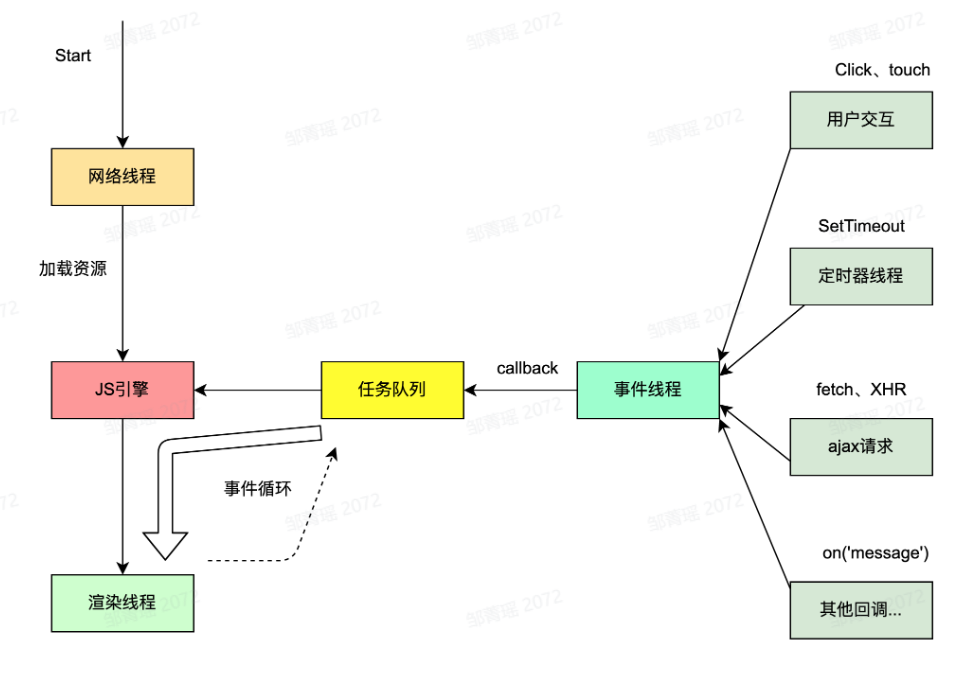
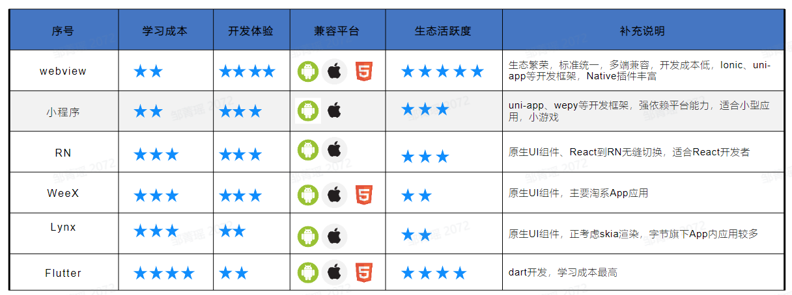

---
group:
  title: 网络
  path: /basic/network/
---

# 客户端容器

## 浏览器架构

### 演进
1. 单进程架构: 所有模块运行在同一个进程里，包含网络、插件、JavaScript运行环境等；
2. 多进程架构: 主进程、网络进程、渲染进程、GPU进程、插件进程；
3. 面向服务架构: 将原来的UI、数据库、文件、设备、网络等，作为一个独立的基础服务；

### 对比

### 多进程分工

进程名称 | 进程描述
---- | ----
浏览器（主进程） | 主要负责页面展示逻辑，用户交互，子进程管理，包括地址栏、书签、前进、后退、收藏夹等
GPU进程 | 负责UI绘制，包含整个浏览器UI
网络进程 | 网络服务进程，负责网络资源加载
渲染进程（标签页） | 控制tab内的所有内容，将Html、css和Javascript转换为用户可交互的网页
插件进程 | 控制网站运行的插件 ，比如flash、ModHeader等
其他进程 | 实用程序 Storage/Network/Audio Service 等

## 渲染进程

### 浏览器内核

国产的切换到极速模式就是切换到webkit内核。

### 多线程架构
浏览器有多个进程，其中的渲染进程又有多个线程，主要负责页面渲染，脚本执行，事件处理和网络请求等；

### JS引擎 VS 渲染引擎
- JS引擎通过`js解析器`解析执行js；
- 渲染引擎通过`xml解析器`和`css解析器`解析生成渲染树，显示在屏幕；

二者通过桥接方式通信。

### 工作流程
1. 网络线程负责加载网页资源
2. JS引擎解析JS脚本并且执行
3. JS解析引警空闲时，渲染线程立即工作
4. 用户交互、定时器操作等产生回调函数放入任务队列中
5. 事件线程进行事件循环，将队列里的任务取出交给JS引擎执行

## Chrome运行原理

### 输入url后都发生了什么

具体来说，和前端相关的流程：
1. 输入处理：看用户输入的是query(搜索引擎拼接url)还是url(直接请求站点资源);
2. 开始导航：用户按回车后，UI线程通知网络线程发起请求，tab开始loading；
3. 读取响应：网络线程接收到http响应后，检查媒体类型MIME TYPE，如果是html就给渲染进程处理，如果是其他（zip, exe）就交给下载管理器处理；
4. 寻找渲染进程：
   - 网络进程任务完成通知主进程；
   - 主进程会寻找一个渲染进程通过IPC消息告知其处理本次导航；
   - 渲染进程回应后导航结束，进入文档加载阶段；
5. 渲染进程处理：
   1. 资源加载：加载html及其子资源（css, js等）；
   2. 构建渲染树：
   
   3. 页面布局：
   
   4. 页面绘制：
   

### 前端优化
- 首屏优化
  1. 网络优化：对请求进行域名拆分，提升并发请求数量；升级到http2；
  2. 静态资源分离：静态资源可以放cdn，不带cookie；
  3. 缓存策略：dns/cdn/http缓存，css,js,图片都可以缓存，用文件hash看是否变化，第二次进入快；
  4. 压缩(字体压缩)、分包（运用浏览器的并行能力）、删除无用代码
  5. SSR
  6. JS脚本非阻塞加载：script标签放body底部，js和渲染引擎互斥；
  7. 预置loading、骨架屏
- 渲染优化
  1. GPU加速：css3，例如用transform做动画；
  2. 减少回流、重绘：transform代替left, top；隐藏可以用visibility替换display；少用table布局；
  3. 离屏渲染：使用一个不可见（或是屏幕外）的 Canvas 对即将渲染的内容的某部分进行提前绘制，然后频繁地将屏幕外图像渲染到主画布上，避免重复生成该部分内容的步骤。
  4. 懒加载：滚动时，当图片进入可视区再加载；
- JS优化
  1. 防止内存泄漏：定时器清除；
  2. 循环尽早break：边界尽早return；
  3. 合理使用闭包
  4. 减少Dom访问：用classname，频繁使用的dom元素缓存起来，省的每次查找；
  5. 防抖、节流：css优化；
  6. Web Workers：和js引擎隔离

## 跨端容器
跨端的意义：
1. 开发成本、效率
2. 一致性体验
3. 前端开发生态：解放客户端人力

常见的跨端方案：
### webview
- 即网页视图，用于加载网页Url，并展示其内容的控件
- 可以内嵌在移动端App内，实现前端混合开发，大多数混合框架都是基于Webview的二次开发，比如lonic、Cordova
- 常见webview分类：Android，IOS、国产Android

优势
- 一次开发，处处使用，学习成本低
- 随时发布，即时更新，不用下载安装包
- 移动设备性能不断提升，性能有保障
- 通过JSBridge和原生系统交互，实现复杂功能

webview使用原生能力：
- Javascript 调用Native
  - API注入: Native获取Javascript环境上下文，对其挂载的对象或者方法进行拦截
  - 使用Webview URL Scheme 跳转拦截
  - IOS_上 window.webkit.messageHandler 直接通信
- Native 调用 Javascript
  - 直接通过webview 暴露的 API 执行JS代码
  - IOS webview.stringByEvaluatingJavaScriptFromString
  - Android webview.evaluateJavascript

webview <-> native 通信：
1. JS环境中提供通信的 JSBridge
2. Native 端提供 SDK 响应JSBridge 发出的调用
3. 前端和客户端分别实现对应功能模块

实现一个简易的JSBridge:

### 小程序
- 微信、支付宝、百度小程序、小米直达号
- 渲染层-webview
- 双线程，多webview架构
- 数据通信，Native转发

### RN/WeeX
- 原生组件渲染
- React/Vue框架
- virtual dom
- JSBridge

### Lynx
字节跨端，首屏有优势
- Vue
- JS Core / V8
- JSBinding
- Native Ul / Skia

### Flutter
谷歌开发的；
- wideget
- dart vm
- skia图形库：各平台的表现一致；

### 通用原理
- UI组件
- 渲染引擎
- 逻辑控制引擎
- 通信桥梁
- 底层API抹平各平台表现差异

### 跨端方案对比

### 思考
- 同样是基于webview渲染 ，为什么小程序体验比webview流畅
做了离线缓存；将危险操作例如dom等给禁止了；

- 未来的跨端方案会是什么
可能会是webview;

## 总结

