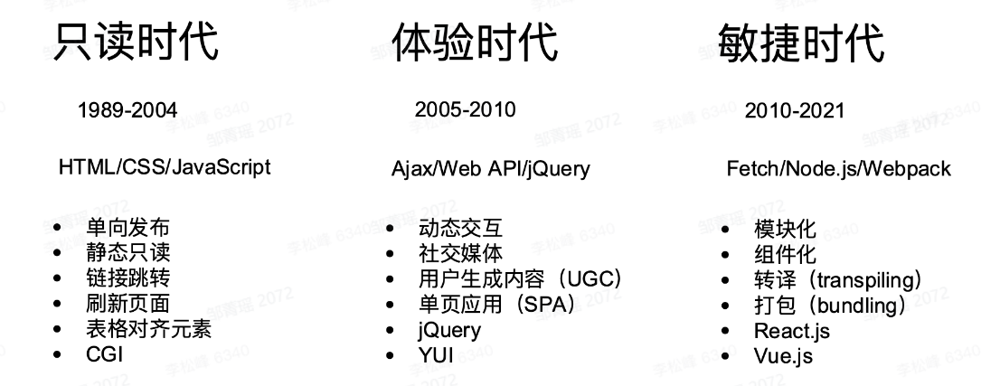
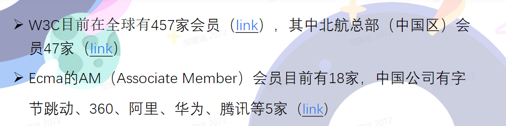
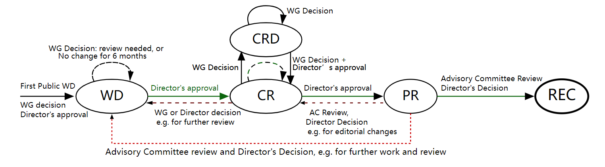
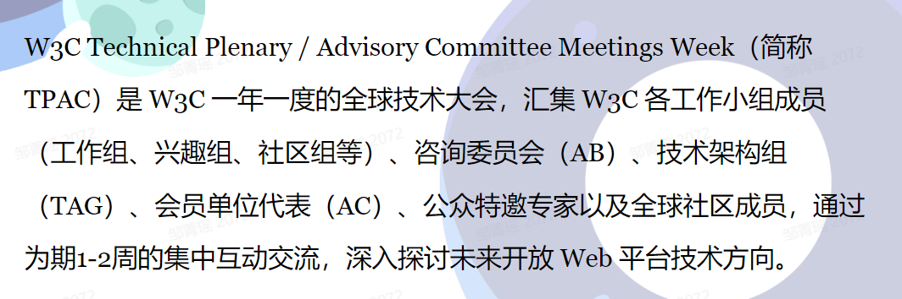

---
group:
  title: 网络
  path: /basic/network/
---

# web 标准与前端开发

## 关于前端开发

### 起源

[Tim Berners-Lee 在 1989 年写的论文 - Information Management: A Proposal](https://www.w3.org/History/1989/proposal.html)

89 年诞生时：Web 由 URL, HTML, HTTP 三种技术构成，css 和 js 都是后面才出现的；

### 变迁

### 浏览器

建议阅读：[深入理解现代浏览器](https://github.com/75team/w3c/blob/master/articles/20190603_cncuckoo_%E6%B7%B1%E5%85%A5%E7%90%86%E8%A7%A3%E7%8E%B0%E4%BB%A3%E6%B5%8F%E8%A7%88%E5%99%A8.md)

### 网络

建议阅读：[An Overview of HTTP](https://developer.mozilla.org/en-US/docs/Web/HTTP/Overview)

### 路线图

建议参考，有很多技术的路线图，赞：[frontend routemap](https://roadmap.sh/frontend)

## 关于 Web 标准

### 标准组织

- W3C: World Wide Web Consortium (四个总部，有一个在北京航空航天大学)
  - [官网](https://www.w3.org)
  - [Github](https://github.com/w3c)
  - [规范查询](https://www.w3.org/TR/)
- Ecma: Ecma International (总部位于日内瓦)
  - [官网](https://www.ecma-international.org/)
  - [TC39](https://tc39.es/)：ECMA 第 39 号技术委员会, 负责制订 ECMAScript 标准；
  - [Github](https://github.com/tc39)
  - [Discourse](https://es.discourse.group/)
- WHATWG：Web Hypertext Application Technology Working Group ( Web 超文本应用技术工作小组，2014 年成立，偏民间组织，是当时苹果、谷歌、微软、Mozila 等浏览器厂商从 W3C 独立出来，为了加快 html 标准的指定)；
  - [官网](https://whatwg.org/)
  - [Github](https://github.com/whatwg)
  - [规范查询](https://spec.whatwg.org/)
- IETF: Internet Engineering Task Force（互联网工程任务组）
  - [官网](https://www.ietf.org/)
  - [Github](https://github.com/ietf)

【W3C 和 Ecma 会员】 

- 其中 W3C 的会员费一年￥ 47w 左右；
- Ecma 的 AM（Associate Member）会员费一年在￥ 20w 左右，还有更高级的会员等级 OM（Ordinary Member）等；

### 规范指定流程

- [W3C 规范制定流程](https://www.w3.org/2020/Process-20200915/#rec-track) 

  - WD(Work Draft, 工作草案)
  - CR(Candidate Recommendation, 候选推荐标准)
  - PR(Proposed Recommendation, 提议推荐标准)
  - REC(Recommendation, 推荐标准)

  具体包括以下几个流程：

  - Explainer(建议说明文档)
  - Find the right community / group (邀请 review)
  - Web IDL for APIs
  - Step-by-step algorithms
  - github, markdown, respec, bikeshed, etc.
  - Get an early review w3ctag(Technical Architecture Group, 技术架构组) / design-reviews
  - Write web-platform-test(WPT) test.

- [Ecma TC39 规范指定流程](https://www.ecma-international.org/publications-and-standards/standards/ecma-262/)
  - [Contributing to EcmaScript](https://github.com/tc39/ecma262/blob/main/CONTRIBUTING.md)

### 如何参与-关注会议

W3C 会议

- 年度会议
  - AC (Advisory Committee)
  - TPAC (Technical Plenary and Advisory Committee)，技术相关，含金量很高； 
- 工作组会议
  - 每月会议
  - 各种[研讨会](https://www.w3.org/participate/eventscal.html)

Ecma 会议

- 年度大会
  - GA (General Assembly)
- TC39 会议
  - 每 1~2 个月
  - [Meeting Calender](https://www.ecma-international.org/about-ecma/meeting-calendar/?order=committee)
