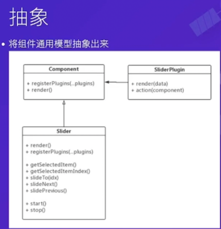

---
group:
  title: 三大语言
  path: /basic/pl/
---

# JS

## 设计原则

### 各司其职

对于纯样式的需求，例如点击按钮切换白天/夜间模式，可以寻求零 JS 方案。

### 组件封装

通过自定义事件修改状态，实现轮播图（这个例子真不错，多看看）；

- 插件化：将控制元素抽取成插件，可配置化； 插件与组件之间通过**依赖注入**方式建立联系；

```js
  class Slider {
    registerPlugins(...plugins) {
      plugins.forEach((plugin) => plugin(this));
    }
  }

  function pluginController(slider) {}
  function pluginPrevious(slider) {}
  function pluginNext(slider) {}

  const slider = new Slider();
  slider.registerPlugins(pluginController, pluginPrevious, pluginNext);
  slider.start();
 ```

- 模版化：将 html 模版化，需要的元素通过 js 参数传递，render 出 dom 结构；
- 抽象化：抽象出组件模型 

### 过程抽象

函数式编程思想、`react hooks`

```javascript
/** 保证函数只被执行一次，覆盖了所有需要执行一次的事件需求，即过程抽象 */
function once(fn) {
  return function (...args) {
    if (fn) {
      const res = fn.apply(this, args);
      fn = null;
      return res;
    }
  };
}
```

## 高阶函数 HOC

```javascript
function HOF0(fn) {
  return function (...args) {
    return fn.apply(this, args);
  };
}
```

特点：

- 以函数作为参数
- 以函数作为返回值
- 常作为函数修饰器
- 常用的 HOF: Once, Throttle 节流, Debounce 防抖, Consumer/2, Iterative

### Throttle

```javascript
function throttle(fn, time = 500) {
  let timer;
  return function (...args) {
    if (timer == null) {
      fn.apply(this, args);
      timer = setTimeout(() => {
        timer = null;
      }, time);
    }
  };
}

btn.onclick = throttle(function (e) {
  circle.innerHTML = parseInt(circle.innerHTML) + 1;
  circle.className = 'fade';
  setTimeout(() => (circle.className = ''), 250);
});
```

### Debounce

```javascript
function debounce(fn, dur) {
  dur = dur || 100;
  var timer;
  return function () {
    // 频繁触发就持续清空定时器，超过dur没操作才会真正执行fn函数
    clearTimeout(timer);
    timer = setTimeout(() => {
      fn.apply(this, arguments);
    }, dur);
  };
}
```

### Consumer

延时批量处理；

```javascript
function consumer(fn, time) {
  let tasks = [],
    timer;

  return function (...args) {
    tasks.push(fn.bind(this, ...args));
    if (timer == null) {
      timer = setInterval(() => {
        tasks.shift().call(this);
        if (tasks.length <= 0) {
          clearInterval(timer);
          timer = null;
        }
      }, time);
    }
  };
}
```

### Iterative

如果参数是可迭代的，循环其每个元素调用函数；

```javascript
const isIterable = (obj) => obj != null && typeof obj[Symbol.iterator] === 'function';

function iterative(fn) {
  return function (subject, ...rest) {
    if (isIterable(subject)) {
      const ret = [];
      for (let obj of subject) {
        ret.push(fn.apply(this, [obj, ...rest]));
      }
      return ret;
    }
    return fn.apply(this, [subject, ...rest]);
  };
}
```

## 命令式和声明式

编程语言可以分为命令式和声明式，命令式分为面向过程和面向对象，声明式分为逻辑式和函数式。声明式天然比命令式具有更强的可扩展性。
