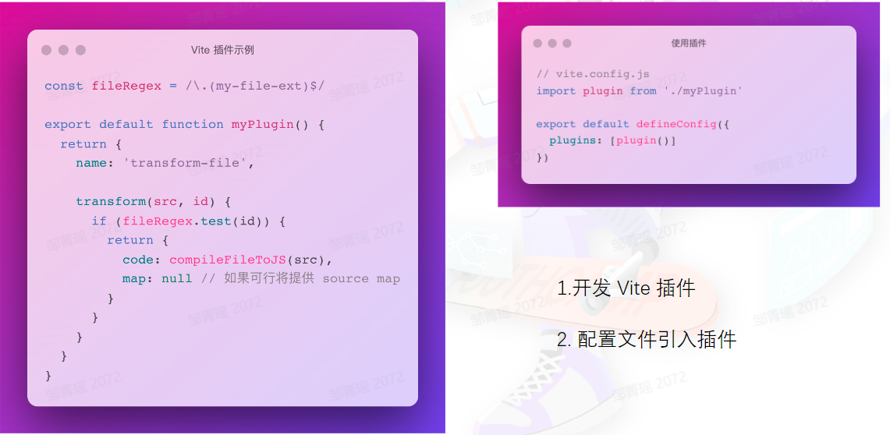

---
group:
  title: 打包
  path: /engineering/bundle/
---

# vite

## 浅谈构建工具

- 模块化：ESM, CommonJS, UMD；
- 资源编译：高级语法的编译；
- 产物质量：代码体积和性能；
- 开发效率：热更新；

前端构建工具的意义: 

## 概要介绍（响应迅速，开箱即用）

业界案例: 

业界构建工具的问题：

- 启动慢：编译等待时间长；
- 热更新慢：代码不能实时更新；

瓶颈在哪里：

- bundle 带来的性能开销；
- js 语言的性能瓶颈，单线程；

两种行业趋势：

- 全球浏览器对原生 ESM 的普遍支持，目前占比 92%； 

基于原生 ESM 的开发服务优势： 

- 基于原生语言编译前端编译工具链；
  - Go 语言编写的 Esbuild；
  - Rust 编写的 SWC；

基于 Esbuild 的编译性能优化： 

内置的 web 构建能力： 

vite VS webpack 

## 上手实战

需要提前安装 pnpm，项目初始化： 

### 使用 Sass/Scss & CSS Module

`pnpm i sass -D`

## 整体架构

### 关键技术

#### 依赖预打包

#### 单文件编译

因为 Esbuild 不支持 ES6 一下的语法，所以生产环境需要先执行 tsc 

#### 代码压缩

#### 插件机制

为何需要插件机制？

- 抽离核心逻辑
- 易于扩展 

插件兼容性具体查阅：https://vite-rollup-plugins.patak.dev/

## 进阶路线

### 深入双引擎

先了解基本使用，动手尝试各项基本配置；然后学习其插件开发，官网都写得很好；

- [Esbuild](https://esbuild.github.io/)
- [Rollup](https://rollupjs.org/)

### vite 插件开发

插件示例： 

参考资料：

- [vite 插件开发文档](https://cn.vitejs.dev/guide/api-plugin.html)
- [json 加载插件，复杂度低](https://bytedance.feishu.cn/file/boxcn7cEYnWeDU4GDyTKHBrPr5c?office_edit=1)
- [Esbuild 接入插件，复杂度中等](https://github.com/vitejs/vite/blob/main/packages/vite/src/node/plugins/esbuild.ts)

### 代码分割（拆包）

参考资料：

- [如何配置 rollup](https://cn.vitejs.dev/config/build-options.html#build-rollupoptions)
- https://rollupjs.org/configuration-options/#output-manualchunks

### JS 编译工具 Babel

参考资料：

- [babel 官方站点](https://babeljs.io/docs/)
- [babel 插件手册](https://github.com/jamiebuilds/babel-handbook/blob/master/translations/zh-Hans/plugin-handbook.md)

### 语法安全降级

参考资料：

- [@babel/preset-env](https://babeljs.io/docs/babel-preset-env)
- [官方降级插件文档](https://github.com/vitejs/vite/tree/main/packages/plugin-legacy)

### 服务端渲染

参考资料：

- [vite-ssr 文档](https://cn.vitejs.dev/guide/ssr.html)

### 深入了解底层标准

参考资料（了解 ESM 规范）：

- https://hacks.mozilla.org/2018/03/es-modules-a-cartoon-deep-dive/
- [ESM or CJS](https://antfu.me/posts/publish-esm-and-cjs)
- https://gist.github.com/sindresorhus/a39789f98801d908bbc7ff3ecc99d99c

### 社区生态

