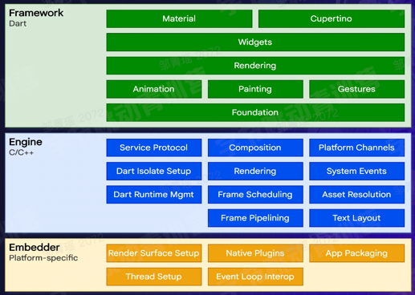

---
group:
  title: 框架
  path: /engineering/framework/
---

# 跨端

## 概述

- PC 端（Wins, Mac）
- 移动端（安卓，ios）
- web 端（pc 浏览器，移动端浏览器）
- IoT 设备（车载设备，手表）

痛点：

- 各端功能一致，但需要各端配置一名开发人员；
- 开发，维护成本高
- 安卓，ios 发版周期长

目标：

- 研发效率高（学习成本低、多端一致性高）
- 用户体验好（稳定性高、性能体验好）
- 动态化（支持动态化下发、满足日益增长的业务需求）

## 跨段技术方案

### hybrid 方案

基于`WebView`渲染，通过`JS Bridge`把一部分系统能力开放给 JS 调用。

WebView 容器的工作原理是基于 Web 技术来实现界面和功能，通过将原生的接口封装、暴露给 JavaScript 调用，JavaScript 编写的页面可以运行在系统自带的 WebView 中，这样做的优势是，对于前端开发者比较友好，可以很快地实现页面跨端，同时保留调用原生的能力，通过搭建桥接层和原生能力打通。但这种设计，跨端的能力受限于桥接层，当调用之前没有的原生能力时，就需要增加桥。另外，浏览器内核的渲染独立于系统组件，无法保证原生体验，渲染的效果会差不少。

### 原生渲染方案

使用 JS 开发，通过中间层桥接后使用原生组件来渲染 UI 界面。

在 Android 开发中是使用 Kotlin 或 Java 来编写视图; 在 i0S 开发中是使用 Swift 或 Obiective-C 来编写视图。在 React Native 中，则使用 react 组件通过 JavaScript 来调用这些视图。在运行时，React Native 为这些组件创建对应的 Android 和 iOS 视图，由于 React Native 组件就是对原生视图的封装，因此使用 React Native 编写的应用外观，感觉和性能与其他任何原生应用一样。我们将这些平台支持的组件称为原生组件。

#### React Native

React Native 是一个由 Facebook 在 15 年 9 月发布的一款 JS 框架，它可以让开发者使用 JS 和 React 来开发跨平台的移动应用。 

React Native 的思路是最大化地复用前端的生态和 Native 的生态，和 WebView 容器的最大区别在于 View 的渲染体系。

React Native 抛弃了低效的浏览器内核渲染，转而使用自己的 DSL 生成中间格式，然后映射到对应的平台，渲染成平台的组件。相对 WebView 容器，体验会有-定的提升，不过，渲染时需要 JavaScript 和原生之间通信，在有些场景可能会导致卡额，另外就是，渲染还是在 Native 层，要求开发人员对 Native 有一定的熟悉度

React Native 主要由 JSI、Fabric、Turbo Modules 组成

##### JSI

JSI 是 Javascript Interface 的缩写，一个用 C++写成的轻量级框架，它作用就是通过 JSI, JS 对象可以直接获得 C++对象(Host Obiects)的引用，并调用对应方法。有了 JSI，JS 和 Native 就可以直接通信了,调用过程如下: JS->JSI->C++->ObjectC/Java。

JSI 是整个架构的核心和基石，所有的一切都是建立在它上面。

- JSI 将支持其他 JS 引擎;
- JSI 允许线程之间的同步相互执行，不需要 JSON 序列化等耗费性能的操作;
- JSI 是用 C++ 编写，以后如果针对电视、手表等其他系统，也可以很方便地移植；

自此三个线程通信再也不需要通过 Bridge，可以直接知道对方的存在，让同步通信成为现实。另外一个好处就是有了 JSI，JS 引擎不再局限于 JSC，可以自由的替换为 V8,Hermes，进一步提高 JS 解析执行的速度。

##### Fabric

Fabric 是新的渲染系统，它将取代当前的 UI Manager UI Manager:

当 App 运行时，React 会执行你的代码并在 JS 中创建一个 ReactElementTree，基于这棵树渲染器会在 C++中创建一个 ReactShadowTree，UI Manager 会使用 Shadow Tree 来计算 UI 元素的位置，而一旦 Layout 完成，Shadow Tree 就会被转换为由 Native Elements 组成的 HostViewTree (例如: RN 里的`<View/>` 会变成 Android 中的 `ViewGroup` 和 ioS 中的 `UIView`)。

而之前线程之间的通信都发生在 Bridge 上，这就意味着需要在传输和数据复制上耗费时间。通过 JSON 格式来传递消息，每次都要经历序列化和反序列化。

而得益于前面的 JSI，JS 可以直接调用 Native 方法，其实就包括了 UI 方法，所以 JS 和 UI 线程可以同步执行从而提高列表、跳转、手势处理等的性能。

##### Turbo Modules

在之前的架构中，JS 使用的所有 Native Modules(例如蓝牙、地理位置、文件存储等）都必须在应用程序打开之前进行初始化，这意味着即使用户不需要某些模块，但是它仍然必须在启动时进行初始化。

Turbo Modules 基本上是对这些旧的 Native 模块的增强，正如在前面介绍的那样，现在 JS 将能够持有这些模块的引用，所以 JS 代码可以仅在需要时才加载对应模块，这样可以将显著缩短 RN 应用的启动时间。

### 自渲染方案

利用 Skia 重新实现渲染管线，不依赖原生组件；

#### Flutter

Flutter 是 Google 在 18 年世界移动大会公布的开源应用开发框架，仅通过一套代码库，就能构建精美的、原生平台编译的多平台应用。 

### 小程序方案

使用小程序 DSL+JS 开发，通过中间层桥接后调用原生能力，使用 WebView 来渲染 UI 界面。

#### 字节小程序

首先，我们来简单了解下小程房的运行环境，小程房的运行环境分成渲染层和逻辑层，其中 ttml 模标和 ttss 样式工作在渲染层，js 脚本工作在逻辑层。小程序的渲染层和逻辑层分别由 2 个线程管理：渲染层的界面使用了 WebView 进行渲染，逻辑层采用 JSC 运行 JS 脚本，一个小程序存在多个界面，所以渲染层存在多个 WebView 线程 ，这两个线程的通信会经由客户端（下文中也会采用 Native 来代指客户端)做中转，逻辑层发送网络请求也经由 Native 转发，小程序的通信模型如图所示。

### 对比

## 基于小程序跨端实践

- [小程序开发文档](https://developer.open-douyin.com/docs/resource/zh-CN/mini-app/develop/guide/introduction/)
- [小程序开发者工具](https://developer.open-douyin.com/docs/resource/zh-CN/mini-app/develop/developer-instrument/download/developer-instrument-update-and-download)

### 小程序性能优化

- 性能评分工具 100 分才上线；
  - Audits 
  - Trace 
