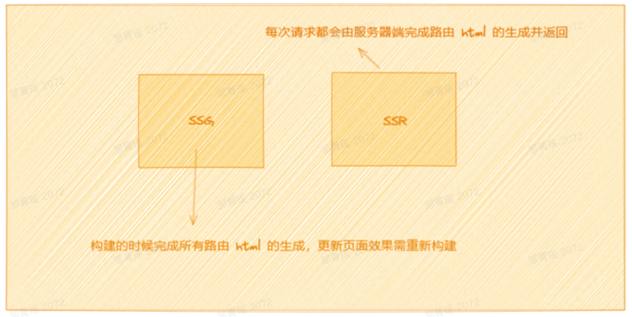
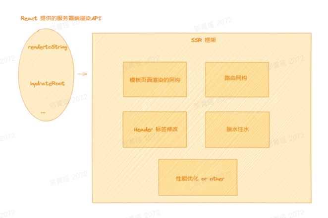
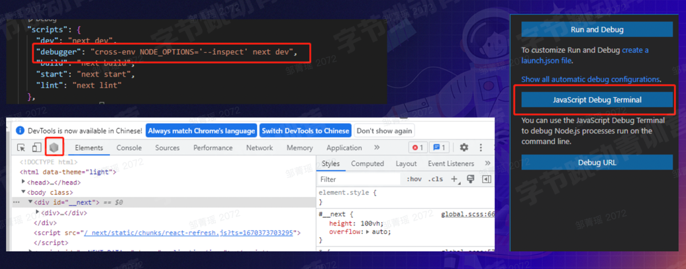
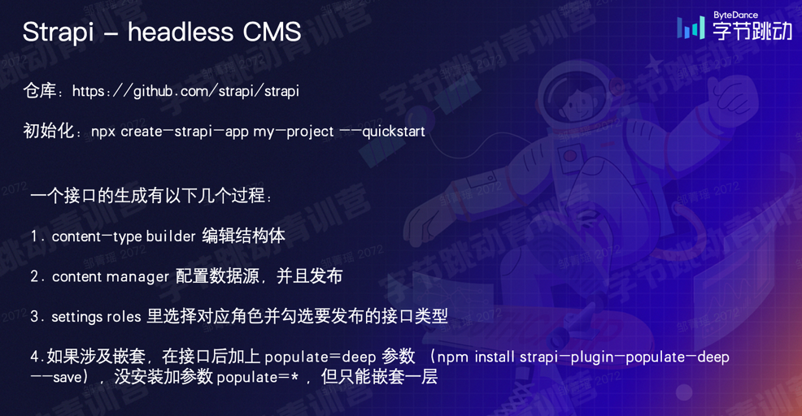

---
group:
  title: 框架
  path: /engineering/framework/
---

# Next.js

目标：具备 C 端 Web 应用开发的基本能力；

- B 端（To Business，通常挂在内网，固定成员能用）
- C 端（To Custom，公开课访问）

## 三种渲染方式：CSR, SSR, SSG

### CSR

客户端渲染（Client-Side Rendering）；常见 B 端 Web 应用开发模式；前后端分离，服务器压力相对更轻；渲染工作在客户端进行，服务器直接返回不加工的 HTML；

SPA: 单页面应用，所需资源在一次请求中完成，不需刷新的动态加载，首屏时间更长；

### SSR

服务端渲染（Server-Side Rendering）；之前的 JSP/PHP 就体现了服务器渲染；

特点：

- 代码耦合度高，模版语言中混杂编程语言；复杂功能维护难；
- Java / PHP 负责渲染的逻辑，前端负责 UI 和交互；

### 同构 SSR

BFF: Backend for Frontend，服务于前端应用的后端；前后端一体化，一套 React 代码在服务器和浏览器都运行一遍，前后端都参与渲染，且首次渲染出的 html 要一致；

### SSG

静态站点生成（Static Site Generation）, 在构建的时候直接把页面结果输出 html 到 CDN, 每次访问直接把 html 返回给客户端，相当于一个静态资源；

特点：

- 大幅减轻 SSR 下服务器的压力；
- 只能生成偏静态的页面，无法生成与用户相关的内容（掘金首页每个用户看到的不同，用的是 SSR）

CDN：建立并覆盖在 Internet 上，由分布在不同区域的边缘节点服务器群组成的分布式网络；



### SSR, SSG 的优势

- 利用 SEO: 搜索引擎可以看成一种爬虫，它会爬取页面的 html，并根据用户输入的关键词对页面内容进行排序检索；
- 更短的首屏时间：SSR/SSG 只需要请求一个 html 就能展现页面，虽然在服务器上会调取接口，但服务器之间的通信远比客户端快，甚至是同一台服务器的本地调取；不再需要请求大量 js 文件；


### 原理：SSR 的实现



重点是同构和脱水注水，保证服务端和客户端渲染结果保持一致。 React 一般用与前后端分离的 B 端应用开发，它也能做 SSR，但是整个过程比较繁琐，难上手；

因此迫切需要一个封装好的集合来快速上手服务器渲染，这就是 Next.js。

## 什么是 Next.js

Next.js 是一个构建在 Node.js 之上的开源 Web 开发框架，支持基于 React 的 web 应用程序功能，例如服务器渲染和生成静态网站。

上手快，能力集全，而且覆盖了足够多的性能优化和生态（之前提高的同构和脱水注水，很多都直接封装了）；

## Next.js 客户端开发

### 初始化

```text
npx create-next-app@latest --typescript
```

### demo 地址

需要 node 16 的版本：

- [CMS demo](https://github.com/czm1290433700/nextjs-cms)
- [Next.js demo](https://github.com/czm1290433700/nextjs-demo)

### 数据注入

CSR 通常利用 useEffect 等钩子在页面生命周期的特定时期进行数据请求，在浏览器调试工具的 Network 可以看到对应的请求；但是 SSR 通常不这样做，在 Network 中也看不到请求（难怪之前看以太坊的图表都没有请求）；

SSR 提供了三个 API 进行数据注入：

- getInitialProps

  基本跑在客户端（但又不完全是，老 API，内部跳转会走客户端路由，可以点断点；但是直接访问/刷新会走服务端）；

- getServerSideProps

  SSG, 在服务器端构建时执行；如果涉及动态路由，要用 getStaticPaths 配置所有可能的参数情况；所以只适合用在页面少而固定的，不适合文章详情页（要把所有文章 id 都提前存到 CDN）;

- getStaticProps

  永远跑在客户端；

- 还有一种注入方式：客户端输入（CSR 常用，SSR 不太用）；

### 多媒体适配

demo 中提供了四种屏幕适配方式，可以参考；JS 适配；

### 大图优化-webp

[png -> webp 工具](convertio.co/zh/png-webp/) 适合慢网；

对于快网，拉取小资源的图片速度快，解析时间就显得很长；

## Next.js 服务端开发

### BFF 层

也就是 api 文件夹，数据搬运工，和 Express 开发等类似，区别是没有参数可以直接区别请求类型；

### 调试

一种通过 IDE，另一种终端执行 debugger 命令； 

### CMS

CMS 数据管理平台，配置网站的内容，不需要每次都研发去改； 

## 核心功能讲解

- 页面 & 动画 & 多媒体适配
- BFF
- strapi
- 多媒体格式的转换
  - markdown 转 html：`npm install showdown --save`
  - html 转 dom: `dangerouslySetInnerHTML`
  - 公共样式的定义
- 主题化功能实现
  - 基础样式和背景的抽离
  - 主题化`context`全局注入
  - 从注入数据中取出`theme`和`setTheme`
  - 多进程间的主题同步（比如 light/dark 存在 localstorage 中，所以开多个页面会同步改变这个主题；但注意如果开 localhost:xxx 和 127.0.0.1xxx，主题不会同步改，跨域了）
