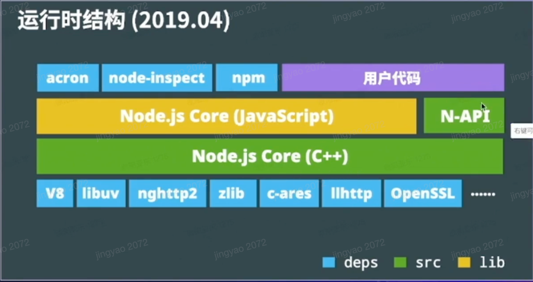
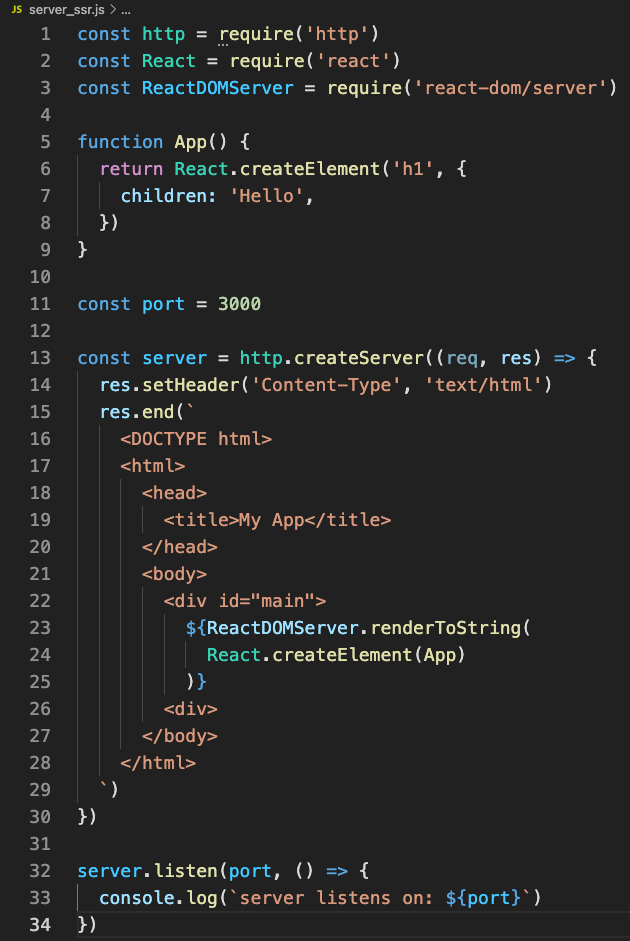
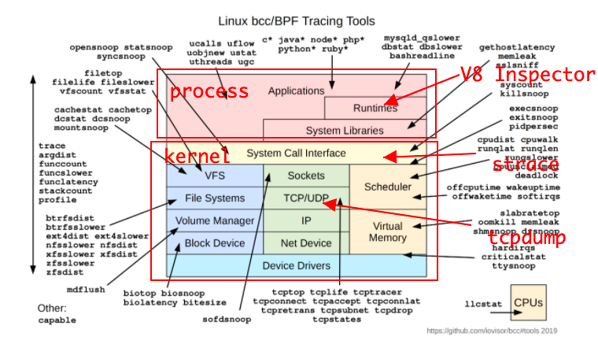

---
group:
  title: 框架
  path: /engineering/framework/
---

# Node.js

Node.js 与前端开发实战

## 应用场景

- 前端工程化
  - Bundle: webpack, vite, esbuild, parcel （打包）；
  - Uglify: Uglifyjs （代码压缩/转换，减少体积）；
  - Transpile: babeljs, typescript （语法转换）；
  - 其他语言加入竞争：esbuild(go), parcel(Rust), prisma；
  - 现状：Nodejs 仍旧难以替代
- web 服务端应用
  - 学习曲线平缓，开发效率较高；
  - 运行效率接近常见的编译语言；
  - 社区生态丰富及工具链成熟（npm, v8 inspector）；
  - 与前端结合的场景有优势（ssr）；
  - 现状：竞争激烈，Node.js 有自己独特的优势；
- Electron 跨端桌面应用
  - 商业应用：vscode, slack, discord, zoom;
  - 大型公司内的效率工具；
  - 现状：大部分场景在选型时，都值得考虑；
- 在字节
  - BFF 应用（谁使用谁开发，接口裁剪）、SSR 应用、举例：Modern.js；
  - 服务端应用：头条搜索、西瓜视频、懂车帝；
  - Electron 应用：飞书、飞连；
  - 每年新增 1000+ Nodejs 应用；

## 运行时结构

  

- v8: JS Runtime, 诊断调试工具（inspector）
- libuv: 事件循环 eventloop、系统调用 syscall

举例：用`node-fetch`发起请求时的调用过程；

### 特点

- 异步 I/O
  - Node.js 执行 I/O 操作时，会在响应返回后恢复操作，而不是阻塞线程并占用额外内存等待；
- 单线程: `worker_thread`可以起独立线程；
  - 实际：JS 线程 + uv 线程池 + v8 任务线程池 + v8 inspector 线程 （JS 主线程是单线程的）
  - 优点：不用考虑多线程状态同步问题，也就无需锁；能比较高效的利用系统资源；
  - 缺点：阻塞会产生更多负面影响，可以通过多线程或者多进程解决；
- 跨平台
  - Node.js 跨平台 + JS 无需编译环境（+ Web 跨平台 + 诊断工具跨平台）；开发学习成本低；

## 编写 http server

### 安装 Node.js


### 编写 http-server

```js
// http_server.js
const http = require('http');

const server = http.createServer((req, res) => {
  res.end('hello');
});

const port = 3000;

server.listen(port, () => {
  console.log('listening on: ', port);
});
```

运行：

```text
jingyaozou@Jingyaos-MacBook-Air node-learn % node http_server.js
listening on:  3000
```

打开 localhost:3000 页面展示 hello；

传递 json 数据：

```js
const http = require('http');

const server = http.createServer((req, res) => {
  const bufs = [];
  // 接收到的数据
  req.on('data', (buf) => {
    bufs.push(buf);
  });

  // 接收完毕
  req.on('end', () => {
    const buf = Buffer.concat(bufs).toString('utf8');
    let msg = 'empty msg';

    try {
      const ret = JSON.parse(buf);
      msg = ret.msg;
    } catch (e) {
      console.log('parse error: ', e);
    }

    const respJson = {
      msg: `received ${msg}`,
    };

    res.setHeader('Content-Type', 'application/json');
    res.end(JSON.stringify(respJson));
  });
});

const port = 3000;

server.listen(port, () => {
  console.log('listening on: ', port);
});
```

### 编写 http-client

```js
const http = require('http');

const body = JSON.stringify({
  msg: 'here is jingyao',
});

const req = http.request(
  'http://127.0.0.1:3000',
  {
    method: 'POST',
    headers: {
      'Content-Type': 'application/json',
    },
  },
  (res) => {
    const bufs = [];
    res.on('data', (buf) => {
      bufs.push(buf);
    });
    res.on('end', () => {
      const receiveMsg = JSON.parse(Buffer.concat(bufs).toString());
      console.log('receiveMsg: ', receiveMsg);
    });
  },
);

req.end(body);
```

在开启 server 的情况下执行 client，控制台输出：

```text
jingyaozou@Jingyaos-MacBook-Air node-learn % node http_client_json.js
receiveMsg:  { msg: 'received here is jingyao' }
```

- 可以试着用 Promise + async/await 改写；

### 编写静态文件服务器

```js
const http = require('http');
const fs = require('fs');
const path = require('path');
const url = require('url');

const folderPath = path.resolve(__dirname, './static');

const server = http.createServer((req, res) => {
  // expected url: http://127.0.0.1:3000/index.html
  const file = url.parse(req.url);

  // static/index.html
  const filepath = path.resolve(folderPath, './' + file.path);

  // stream api（占用尽可能少的内存空间，用读流的方式肯定比直接把整个文件读进来好）
  const filestream = fs.createReadStream(filepath);
  filestream.pipe(res);
});

const port = 3000;

server.listen(port, () => {
  console.log('listening on: ', port);
});
```

启动静态文件服务器：

```text
jingyaozou@Jingyaos-MacBook-Air node-learn % node static_server.js
listening on:  3000
```

浏览器打开`http://localhost:3000/index.html`，就能看到 static/index.html 的内容；

与高性能、可靠的服务相比，还差什么？

- CDN: 缓存（都要读取的 index.html 不需要每次都从磁盘读，放缓存里） + 加速；
- 分布式存储，容灾

一些常用的外部服务：cloudflare, 七牛云、火山云、阿里云...

### React SSR



SSR 难点：

- 需要处理打包代码；
- 需要思考前端代码在服务端运行时的逻辑；
- 移除对服务端无意义的副作用或重置环境；

### Debug

- V8 Inspector：开箱即用，特性丰富强大，与前端开发一致、跨平台；
  - 使用：通过`node --inspect xxx.js`，启动并使用 V8 调试功能；然后在浏览器打开[网址/json]会出现`devtoolsFrontendUrl`，打开该 url 就可以使用调试功能。
  - 场景：
    - 查看 console.log 内容
    - breakpoint（可以用 logpoint 不阻塞执行，相当于插入一条 log）
    - 高 CPU、死循环：cpuprofile
    - 高内存占用：heapsnapshot
    - 性能分析

### 部署

部署要解决的问题：

- 守护进程：当进程推出时，重新拉起；
- 多进程：cluster 便捷地利用多线程；
- 记录进程状态，用于诊断；

容器环境：

- 通常有健康检查手段，只需考虑多核 CPU 利用率即可；

## 延伸

- 贡献 Node.js 代码: 快速了解 Node.js 代码；[Node.js Core 贡献入门](https://github.com/joyeecheung/talks/blob/master/code_and_learn_2019_beijing/contributing-to-node-core.pdf)

- 编译 Node.js 代码

  - 参考 [Maintaining the build files](https://github.com/nodejs/node/blob/main/doc/guides/maintaining-the-build-files.md)
  - ./configure && make install

- 诊断/追踪 

- WASM, NAPI 
