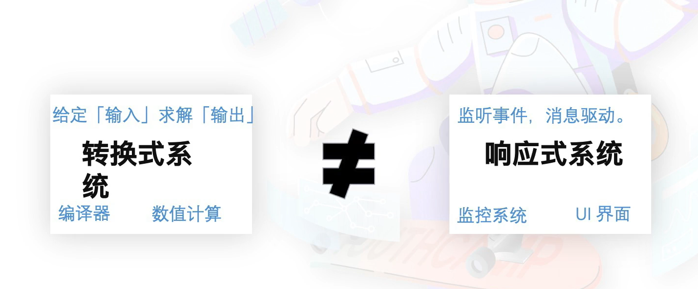

---
group:
  title: 框架
  path: /engineering/framework/
---

# React

React 的应用场景：

- 前端应用开发: Facebook, instagram, Nexflix 网页版；
- 移动原生应用开发：instagram, Discord, Oculus;
- 结合 Electron，进行桌面应用开发

## 历史

2010 年 Facebook 在 xhp 框架中引入了组合式函数的思想；2011 年 Jordan Walke 创造了 FaxJS，这也是后来 React 的原型； 12 年 Jordan Walke 在 FaxJS 基础上创造了 React，并在 13 年开源。


推荐看下面这个视频，说 React 是一个 js 库，没说是框架：

[Tom Occhino and Jordan Walke: JS Apps at Facebook](https://www.youtube.com/watch?v=GW0rj4sNH2w)


React 三个特点：

- 声明式组件，没有显式的数据绑定；
- 组件化，嵌入式的 XML 语法，称作 jsx；
- 跨平台编写，虚拟 dom；

---

和 java 中的 jsp 类似，声明式、模板化去写前端，有人说 React 是技术的倒退，但是为什么生态会越来越好？ 

## 设计思路

### 响应式编程


### 转换式 or 响应式




### 状态归属问题


### 组件化

props 和 state 分别对应了组件从父组件继承的参数和内部的状态变量；


### 生命周期


## 原理

### Virtual DOM


- diff 算法要在更新次数和计算速度上平衡；完美的最小 Diff 算法，需要 O(n^3)；牺牲理论最小 diff 换取时间，得到了 O(n)的算法；

- heuristic O(n) Algorithm
- 不同类型的元素 替换
- 同类型的 DOM 元素 更新
- 同类型的组件元素 递归

所有元素都只遍历了一边，O(n)。

### 更新流程


### Fiber

> Fiber 是 React 16 中采用的新协调（reconciliation）引擎，主要目标是支持虚拟 DOM 的渐进式渲染。

- React 16 之前使用的是 Stack Reconciler（栈协调器），使用递归的方式创建虚拟 DOM，递归的过程是不能中断的。如果组件树的层级很深，递归更新组件的时间超过 16ms，用户交互就会感觉到卡顿。
- React 16 及以后使用的是 Fiber Reconciler（纤维协调器），将递归中无法中断的更新重构为迭代中的异步可中断更新过程，这样就能够更好地控制组件的渲染。

将原有的 Stack Reconciler 替换为 Fiber Reconciler，提高了复杂应用的可响应性和性能。主要通过以下方式达成目标：

- 对大型复杂任务的分片。
- 对任务划分优先级，优先调度高优先级的任务。
- 调度过程中，可以对任务进行挂起、恢复、终止等操作。

Fiber Node 的样子：

```text
{
    tag: TypeOfWork, // 标识 fiber 类型
    type: 'div', // 和 fiber 相关的组件类型
    return: Fiber | null, // 父节点
    child: Fiber | null, // 子节点
    sibling: Fiber | null, // 同级节点
    alternate: Fiber | null, // diff 的变化记录在这个节点上
    ...
}
```

[Fiber 是如何工作的](https://cloud.tencent.com/developer/article/1882296)

## 合成事件

> React 合成事件（SyntheticEvent）是 React 模拟原生 DOM 事件所有能力的一个事件对象，即浏览器原生事件的跨浏览器包装器。它根据 W3C 规范 来定义合成事件，兼容所有浏览器，拥有与浏览器原生事件相同的接口。

主要有三个目的：

- 跨平台：抹平不同浏览器事件对象之间的差异，保证冒泡一致性。
- 内存优化：避免事件对象被频繁创建和销毁，采用事件池复用对象；合成事件对象在事件池统一管理，不同类型的合成事件具有不同的事件池。
- 事件统一管理；

主要对合成事件做了两件事：

- 事件委派：React 会把所有的事件绑定到结构的最外层，使用事件监听器进行统一管理，这个事件监听器上维持了一个映射来保存所有组件内部事件监听和处理函数。
- 自动绑定： React 组件中，每个方法的上下文都会指向该组件的实例，即自动绑定 this 为当前组件。

和原生事件的区别：

- 命名不同：原生事件全小写，合成事件小驼峰；
- 事件处理函数写法不同：原生事件写函数名调用的字符串形式，合成事件直接传函数；

事件执行顺序：

- 合成事件的监听器是统一注册在 document 上的,并且仅有冒泡阶段。所以原生事件的监听器响应总是比合成事件的监听器早
- 阻止原生事件的冒泡后,会阻止合成事件的监听器执行

```jsx | pure
// 原生事件 事件处理函数写法
<button onclick="handleClick()">Leo 按钮命名</button>;

// React 合成事件 事件处理函数写法
const button = <button onClick={handleClick}>Leo 按钮命名</button>;
```

- 阻止默认行为方式不同: 在原生事件中，可以通过返回 false 方式来阻止默认行为，但是在 React 中，需要显式使用 preventDefault() 方法来阻止。

## hooks

- 不要在循环、条件、嵌套中使用 hooks；


## React 状态管理库

将状态抽离到 UI 组件外部进行统一管理；

React 的组件内部有状态，但是不是所有的状态都适合放在某个组件内部，比如当前用户，或者主题等很多组件，很多 dom 节点都需要用到的状态，就适合抽离出来，形成状态库，然后所有节点都可以获取，而不是一层层传递。

通过状态机管理，也就是当前状态通过某种外部事件的触发，转移到下一个状态。


- Bytedance 开发的基于 React 的全栈开发框架 Modern.js(状态管理工具 Reduck)

## 应用级框架科普


## React-router


路由变化过程：监听url变化(history) -> 路由匹配(react-router) -> 页面渲染(react-router-dom)

- BrowserRouter: 基于history，形如https://www.abc.com/a/b/c
- HashRouter: 基于hash，形如https://www.abc.com/#/a/b/c

React-router-history: 包裹路由，感知url变化，提供provider供嵌套children消费；
- MemoryRouter: 无浏览器环境，测试或react-native环境；将当前location存储在memory中；
- BrowserRouter：将location存储在url中；
- HashRouter：location存储在window.location.hash中
