---
group:
  title: 测试
  path: /engineering/testing/
---

# 自动化测试

## what

研发层面的，不针对某次迭代；

## why

- 统一风格；
- 组件 Readme 用例化，保持时效性；
- 有效审视代码中的耦合逻辑；
- 避免后续迭代影响到历史功能，发布 breaking change（不兼容之前版本的发布）；

## 技术选型

推荐 React testing library, (React 18 官方推荐，用户视角，无需知道代码内部结构)；Enzyme 允许访问内部，和代码内部结构绑定多，属于破坏性的测试，测试用例可能需要频繁更改，不够有强壮性；

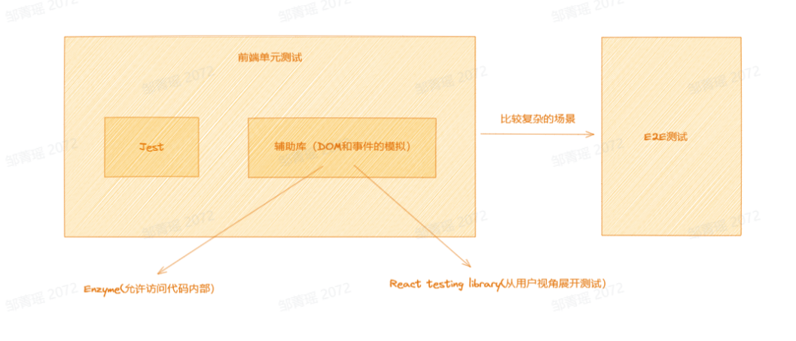

E2E 无需知道内部细节；单元测试需要知道内部细节；

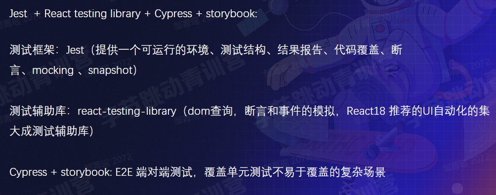

## how

- [配置示例仓库](https://github.com/czm1290433700/test_demo_for_config)
- [demo 仓库](https://github.com/czm1290433700/test_demo)

测试用例类型：

1. 可见性测试

### 基本元素

- describe: 模块，描述一组测试用例；
- test: 用例，一条测试用例及一组需要验证的逻辑；
- render：渲染元素；
- getByRole: 查询 dom 元素；查询的 api: 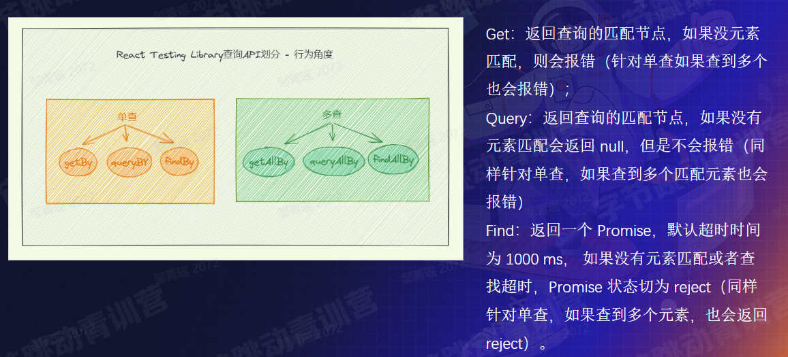

其中 role 就是一种无障碍属性： 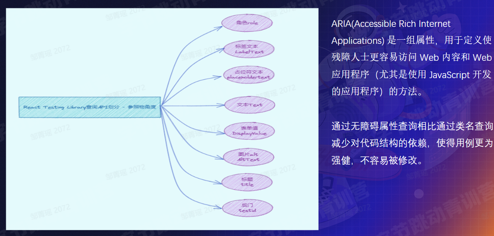

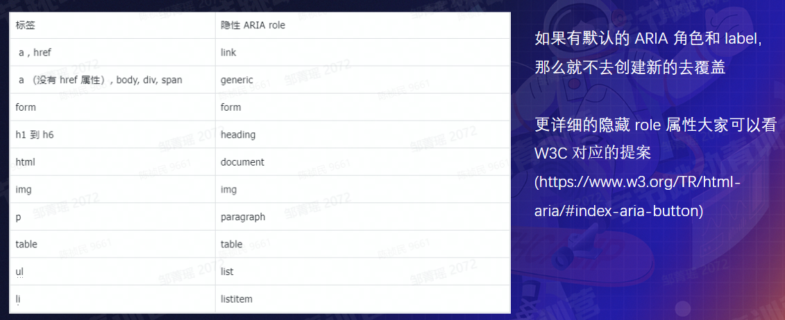

- toBeEmptyDOMElement：断言，对查询元素的预期； 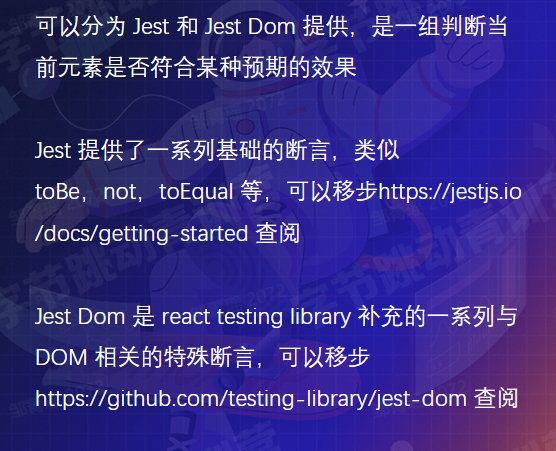

### 事件模拟

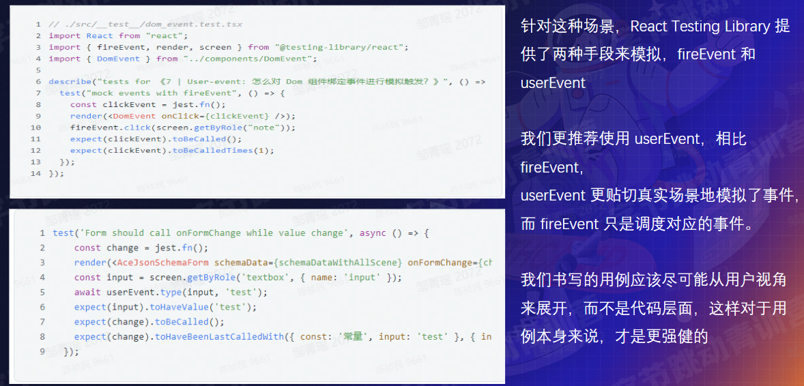

更推荐用 userEvent 而不是 fireEvent，因为更加真实，比如用户点击并不是直接调用方法，而有一个鼠标移入移出、hover 的过程和效果。

但 userEvent 需要针对具体事件指定具体的函数，有一部分事件还没有对应的 userEvent，这种就可以用 fireEvent，相比之下 fireEvent 是通用的事件处理，不需要针对事件定制，覆盖的事件就比较多。

### 异步

对于过一段时间展示出文字的异步情况如何测试，可以用 findBy，想自定义超时时间可以用 waitfor； 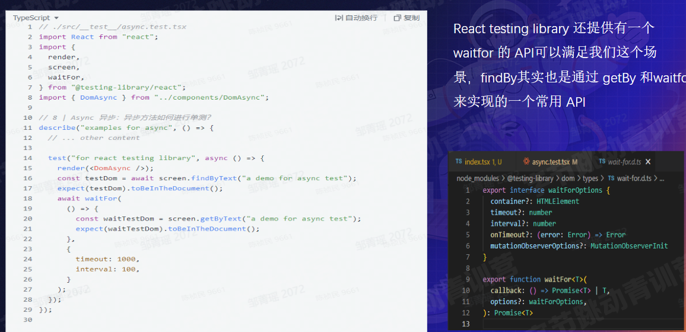

### 快进异步任务

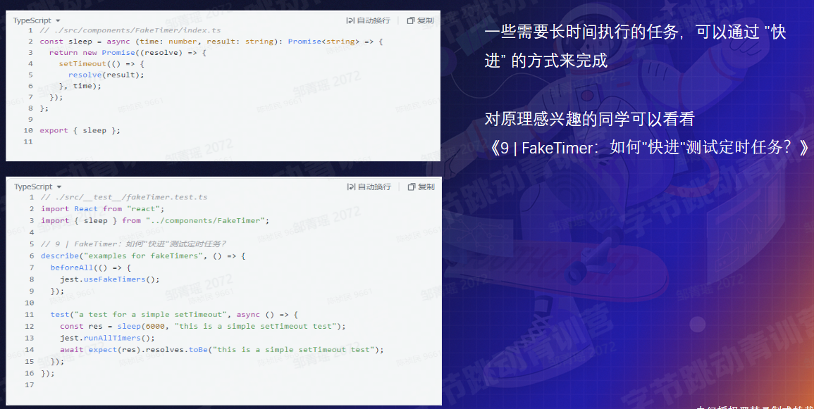

### Mock

mock 到第三方的返回结果，保证测试用例的功能单一；

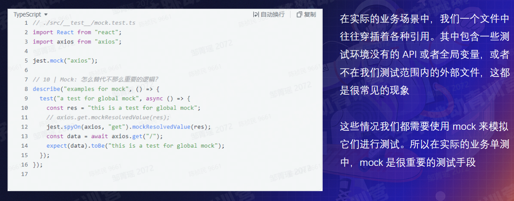

### 快照测试

有的组件 dom 元素很多，一个个去断言也太蠢了；可以用快照，每次都是和历史快照进行 ui 上的对比； 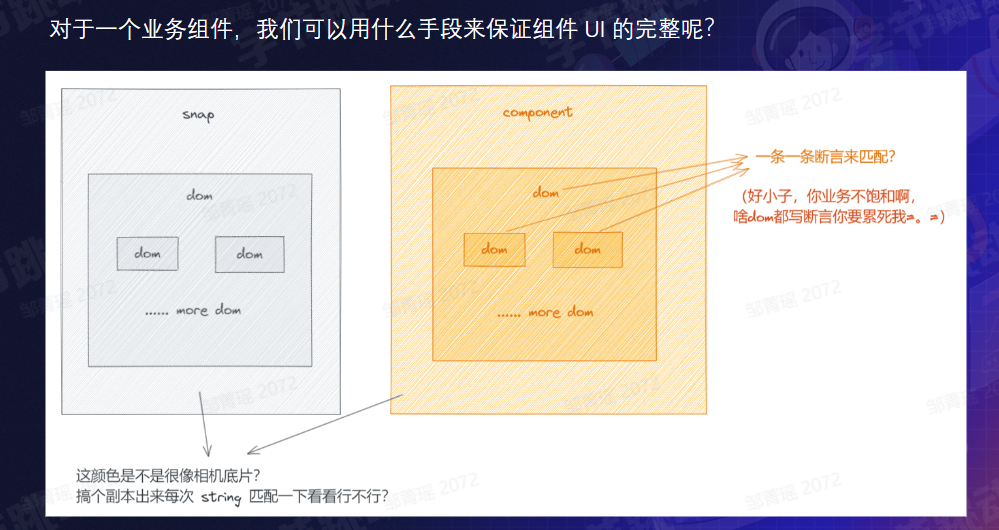 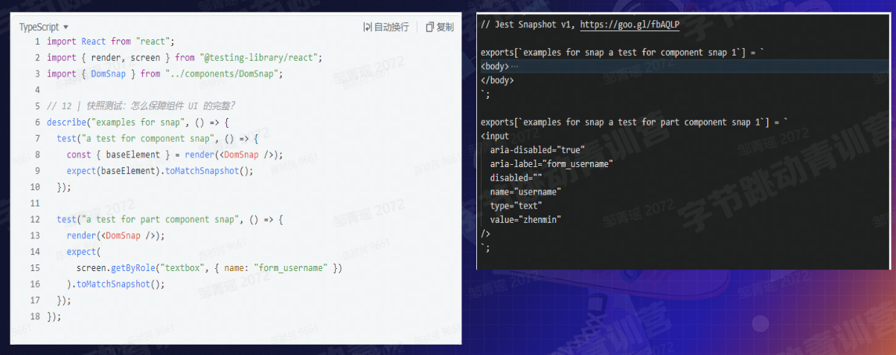

### E2E

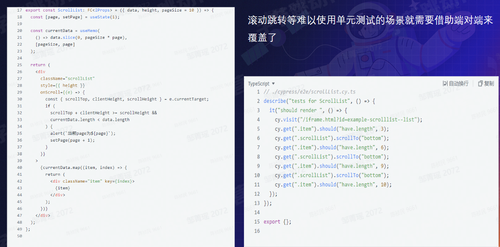 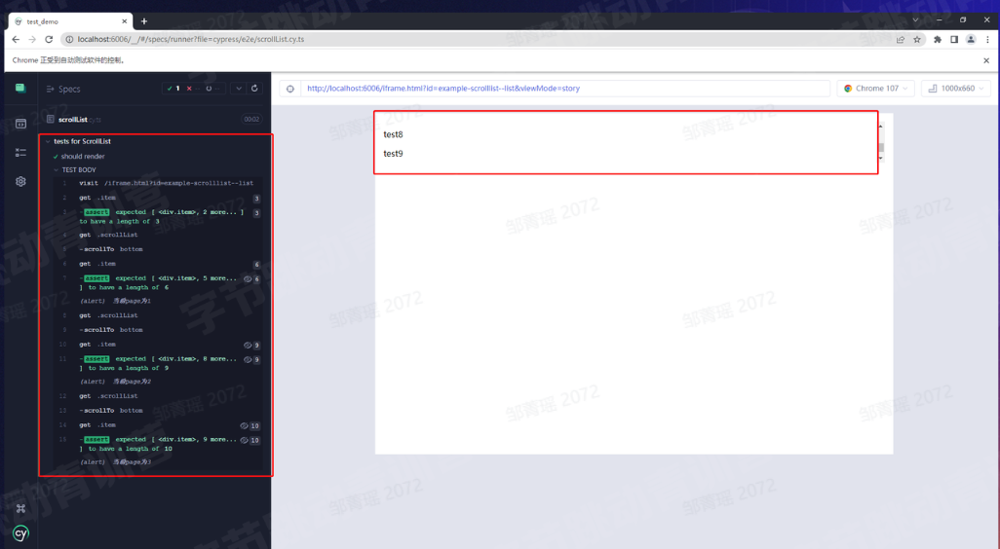

左边是测试用例，右边是执行结果，这个挺有意思，看看 demo；还有个[掘金小册 ￥ 29.9 《自动化测试精讲》](https://juejin.cn/book/7174044519350927395)；

## ci

- 覆盖率 & 提升覆盖率；
- 可以通过 git actions 把用例的执行和覆盖率控制进项目的 cicd；
