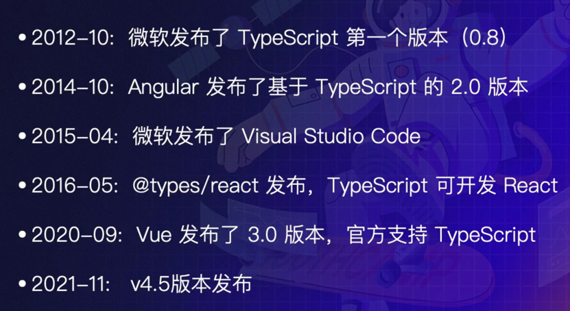
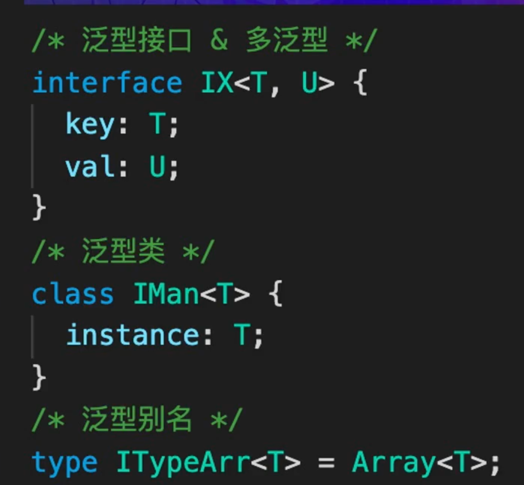
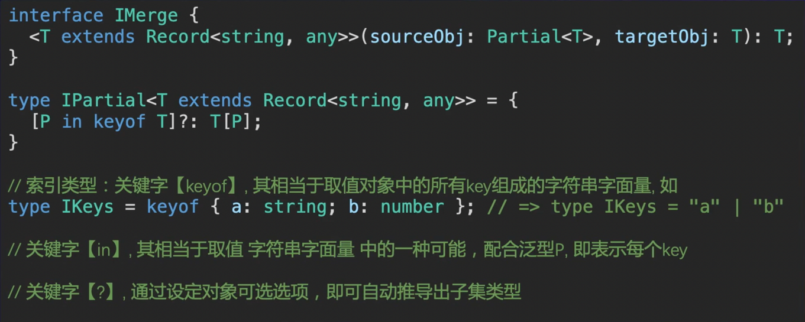
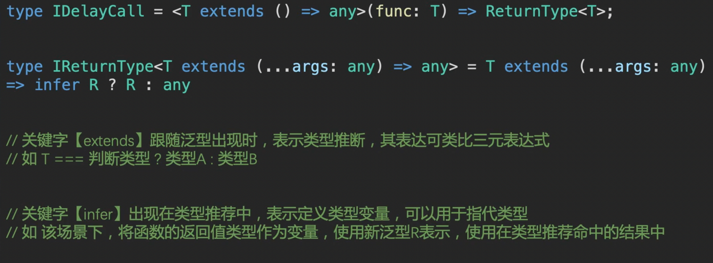
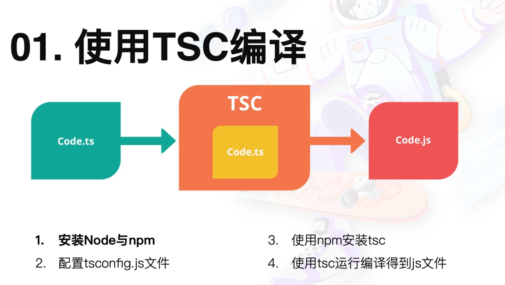

---
group:
  title: 转译
  path: /engineering/transpile
---

# TS

TypeScript 历史：



JS: 动态类型、弱类型语言 TS：静态语言、弱类型语言（指是否会强制进行类型转换）

## 基本语法

- 基本类型
- 对象类型
- 函数类型
- 数组类型
- TS 补充类型：空类型、任意类型 any、枚举类型 Enum
- TS 泛型
  - 泛型接口 & 多泛型
  - 泛型类
  - 泛型别名
  - 泛型约束
  - 泛型可以传默认值
  - 类型断言 as
  - 字面量 字符串/数字 

## 高级类型

- 联合/交叉类型(|, &)

```typescript
type IBook = { author: string };
type IHistoryBook = IBook & { type: 'history' };
type IStoryBook = IBook & { type: 'story' };
type IBookList = Array<IHistoryBook | IStoryBook>;
```

- 类型保护与类型守护访问联合类型时，只能访问联合类型中的交集部分；

```typescript
interface IA {
  a: 1;
  a1: 2;
}

interface IB {
  b: 1;
  b1: 2;
}

/** 类型守护函数 */
function getIsIA(arg: IA | IB): arg is IA {
  return !!(arg as IA).a;
}
```

考虑 merge 函数中的类型定义 

其中 IPartial 类型用的很多，已经内置在 TS 中了。

- 函数返回值类型  注意关键词 infer 是用来指代 未定义、无类型名 的类型变量的。

```typescript
type IReturnType<T extends (...args: any) => any> = T extends (...args: any) => infer R
```

其中`infer R`是一个整体， 指代函数返回值的类型，然后说如果传入的类型值是继承自类型`(...args: any) => infer R`的，即符合约定的，那么`IReturnType`就是刚定义的类型 R 的别名，否则就是 any。

## TS 工程应用

主要分为浏览器 Web 和 NodeJs 两种应用。

### web

- webpack 通常是响应式的；

1. 配置 webpack loader：将 webpack 识别不了的文件转化其可以识别的，例如 ts->js，webpack 主要是处理 js 文件的；
2. 配置 tsconfig.js 文件；
3. webpack 启动/打包;
4. loader 处理 ts 文件时，会做编译和类型检查

相关 loader：

- [awesome-typescript-loader](https://www.npmjs.com/package/awesome-typescript-loader)，tsc 引擎
- [babel-loader](https://www.npmjs.com/package/babel-loader), babel 引擎

### NodeJs

需要手动执行 tsc 命令；


