---
group:
  title: 实习八股
  path: /interview/internship/
---

# 浏览器

## [同源策略](https://www.ruanyifeng.com/blog/2016/04/same-origin-policy.html)

协议、域名和端口均相等成为同一个域。

- 同源策略是**浏览器的安全策略**，请求发送到后端，后端返回数据时被浏览器的跨域报错拦截。注意服务端是没法判断请求是否跨域的，所以**请求在服务端是执行了的**，只不过返回时被浏览器拦截，返回值被隐藏了。
- 一般生产环境不跨域，开发环境跨域，经常使用开发代理来解决这个问题。
- 同源策略下，非同源会**在 DOM, 数据**（storage, cookie, indexDB）、**网络请求**三个方面的行为上有限制；
- 有三个标签允许跨域加载资源`, <link href=XXX>, <script src=XXX>`;
- form 可以跨域提交，同源限制的是读取跨域数据，而不是阻止提交；

### 解决跨域

前后端分离的开发场景下通常应用 `nginx` 反向代理来解决跨域，将前后端的实际地址都映射成相同的代理域名，消除同源限制。

下面是一些老的跨域方式:

#### ajax 请求跨域

- JSONP：`<script src="xxx">`，将请求地址（只能发 GET）放在 script 标签的 src 中，不受同源限制；请求必须带 callback，拿到服务器的响应，返回的 json 数据直接被看成 JS 对象；
- WebSocket: 一种通信协议，以 ws://或 wss://开头，不实行同源策略，请求时带 Origin 参与，由服务器决定是否允许本次请求；
- [CORS(Cross-Origin Resource Sharing)](https://www.ruanyifeng.com/blog/2016/04/cors.html)，AJAX 请求跨域终极解决方案，支持任何请求方法，W3C 标准；
  - 服务端设置 Access-Control-Allow-Origin，表示哪些域名可以访问资源；简单请求直接发送，复杂请求会先发一个 OPTIONS 方法的预检请求；
  - 简单请求：请求头加 Origin 字段；服务端允许则响应头添加`Access-Control-`开头的 CORS 相关字段，没返回`Access-Control-Allow-Origin`，就会抛出错误；

```text
（1) 请求方法是以下三种方法之一：

HEAD
GET
POST
（2）HTTP的头信息不超出以下几种字段：

Accept
Accept-Language
Content-Language
Last-Event-ID
Content-Type：只限于三个值application/x-www-form-urlencoded、multipart/form-data、text/plain
```

- 复杂请求：先发送 OPTIONS 预检；

#### 数据跨域

- cookie, iframe 可以设置 cookie.domain 共享 Cookie;
- storage, indexDB 可以通过`window.postMessage`跨域通信；通过 message 事件，监听对方的消息；

## [正向、反向代理](https://www.zhihu.com/question/36412304)

- 正向是 Client 和其他所有服务器之间的代理，代理冒充客户端；
- 反向是 Client 和所要代理的服务器之间的代理，代理冒充服务端；

## DNS 查询

- 主机向本地域名服务器的查询一般都是采用递归查询；也就是本地域名服务器不知道对应 ip 就替代主机去继续问别的域名服务器；**返回的结果只有查询成功或查询失败两种**。
- 本地域名服务器向根域名服务器的查询的迭代查询；也就是如果没有，就告诉本地域名服务器下一次去哪问，**返回的是最佳的查询点或者主机地址**；

## 路由

- hash 路由：会在 url 后面增加`#`号，#后面的值为 hash 值，这个值变化不会刷新页面和向服务器发请求；但其变化会被浏览器记录下来，控制页面的前进和后退；
- history 模式，允许直接修改前端路由，更新 URL 但不重新发请求，history 可⾃定义地址；`window.history`属性指向 `History` 对象，表⽰当前窗口的浏览历史，保存了当前窗口访问过的所有页⾯⽹址；（`history.go, back, push`等）

## 缓存

- http 缓存（`Cache-Control/Pragma,Expires,Last-Modified/Etag`等 HTTP 字段）
  - 强缓存（`浏览器决定`是否使用）
    - `Expires(HTTP/1.0)`, 指示服务器请求返回结果的缓存到期时间，但 c/s 如果时区不同直接无意义；
    - `Cache-Control(HTTP/1.1)`, 指示过期时长，优先级比`Expires`高;
  - 协商缓存：强制缓存失效后，browser 携带缓存标识 tag 向 server 发请求进行协商，由`服务器`根据缓存 tag`决定`是否使⽤缓存；
    - `Last-Modified(HTTP/1.0)`：指示最后⼀次修改时间，第一次请求服务器加该字段，第二次请求，浏览器把该值会加上`If-Modified-Since`字段；
    - `ETag(HTTP/1.1)`：第一次请求服务器给当前请求的资源⽣成的唯⼀标识，后续请求浏览器把该值放在`If-None-Match`字段；优先级比`Last-Modified`高;

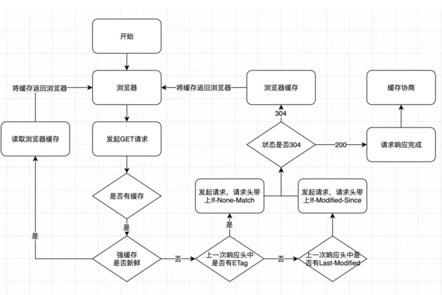

- 浏览器缓存；
  - cookie: 解决 `如何记录客户端⽤户信息` 的问题。保存在本地的⼀部分数据，再次发送请求被携带传送到服务器，实现保持⽤户登录等，使基于⽆ HTTP 协议记录的信息状态稳定成为可能；
  - localStorage: 同一个域名下，只能写入字符串；一般 5M；
  - sessionStorage: 和 localStorage 唯⼀不同就是⽣命周期，页⾯关闭，sessionStorage 将会被删除；
  - storage 前端数据库：扩展的前端存储⽅式，是运⾏在浏览器中的⾮关系型数据库，理论上容量⽆上限。
    - WebSql（废弃）和 IndexDB；
  - 应用缓存：通过 manifest ⽂件来注册被缓存的静态资源，已经被废弃；

## CDN

Content Delivery Network，即内容分发网络，应用缓存和代理技术，代替源站响应客户端的请求。 CDN 是构建在现有网络基础之上的网络，它依靠部署在各地的边缘服务器，通过中心平台的负载均衡、内容分发、调度等功能模块，使用户就近获取所需内容，降低网络拥塞，提高用户访问响应速度和命中率。 CDN 的关键技术主要有内容存储和分发技术。

## 鉴权

- session + cookie session 是服务端维护的会话集群，比如用 redis 存储；请求时在 cookie 中设置 sessionId，服务器就能去 redis 中找到会话基本信息；但需要服务器维护一个 session 数据库；
- Json Web Token（Auth0 提出的通过 对 `JSON` 进行加密签名来实现授权验证的方案；）由三部分组成： `Header` 头部、 `Payload` 负载 和 `Signature` 签名，由`.`分割； Payload 负载可以存储常用信息，用于信息交换，有效地使用 JWT，可以降低服务端查询数据库的次数；
- OAuth: 通过授权第三方信息进入应用，如何通过 qq 登录其他身份；// TODO

## 回流和重绘

- 重绘：某些元素的外观被改变所触发的浏览器行为（重新计算节点在屏幕中的绝对位置并渲染的过程）；
  - color
  - border-style
  - border-radius
  - text-decoration
  - box-shadow
  - outline
  - background ...
- 回流：重新生成布局，重新排列元素（重新计算各节点和 css 具体的大小和位置：渲染树需要重新计算所有受影响的节点）；
  - 页面初始渲染，这是开销最大的一次重排;
  - 添加/删除可见的 DOM 元素;
  - 改变元素位置;
  - 改变元素尺寸，比如边距、填充、边框、宽度和高度等;
  - 改变元素内容，比如文字数量，图片大小等;
  - 改变元素字体大小;
  - 改变浏览器窗口尺寸，比如 resize 事件发生时;
  - 激活 CSS 伪类（例如：:hover）;
  - 设置 style 属性的值，因为通过设置 style 属性改变结点样式的话，每一次设置都会触发一次 reflow; 查询某些属性或调用某些计算方法：offsetWidth、offsetHeight 等，除此之外，当我们调用 getComputedStyl 方法，或者 IE 里的 currentStyle 时，也会触发重排，原理是一样的，都为求一个“即时性”和“准确性”;
  - ...

要尽可能减少回流和重绘次数，缩小范围。

## 页面生命周期

HTML 页面的生命周期包含三个重要事件：

- DOMContentLoaded：完全加载 html, DOM 树建立完成；
- load: 除了 html 外，还完成了所有外部资源的加载，例如图片，样式；
- beforeunload / unload: 用户离开页面时；

## 抓包

- [为什么我抓不到 baidu 的数据包](https://juejin.cn/post/7165737844613316638)

## WEB 安全

### [XSS](https://cloud.tencent.com/developer/article/1812929?from=article.detail.1814643&areaSource=106000.2&traceId=_GpVy3gJTgPLkQ1MRy_Xh)

Cross-Site Script, 跨站脚本攻击；核心的攻击原理就是注入有攻击行为的脚本代码，通过浏览器的执行从而完成攻击行为。 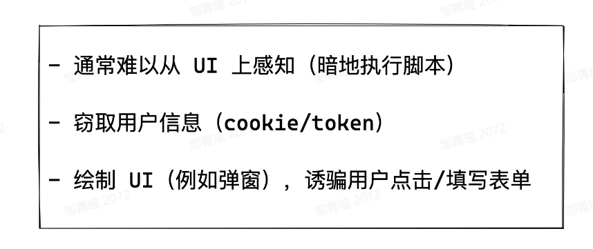

#### Stored XSS

黑客将恶意脚本注入在服务器中，其他用户访问时，服务端把含有恶意脚本的代码返回给了客户端，浏览器执行注入了恶意脚本的 HTML，从而实现了攻击行为。

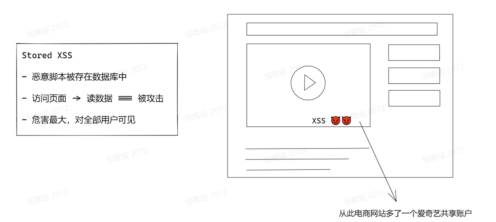

#### Reflected XSS

从 URL 上进行攻击，一般出现在服务器没有经过正确编码而直接使用客户端提供的数据的情况下出现，即盲目信任用户输入。

#### DOM-based XSS

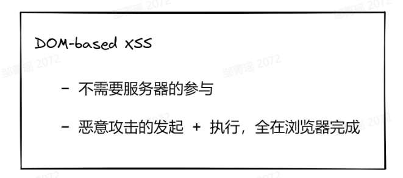

#### 防御

- 永远不要信任用户的提交
  - 不要将用户提交内容直接转 DOM
- 谨慎处理以下情况：
  - string -> DOM
  - svg 上传
  - Blob 动态生成 script
  - 自定义跳转链接
  - 自定义样式(radio 的背景可以设置恶意请求 url)
- 内容安全策略(CSP, Content Security Policy) 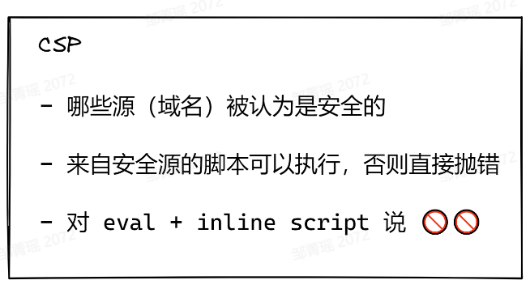 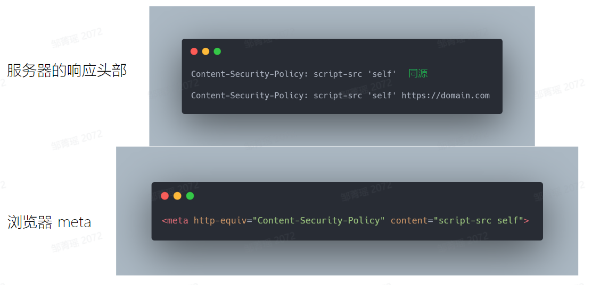

### CSRF

Cross Site Request Forgery, 跨站伪造请求；攻击原理就是将一段非法的连接地址以某种方法发送给用户，诱因用户点击，而点击这个是会向另一个接口发送请求信息，在不知不觉中就暗中进行了一些敏感的操作。

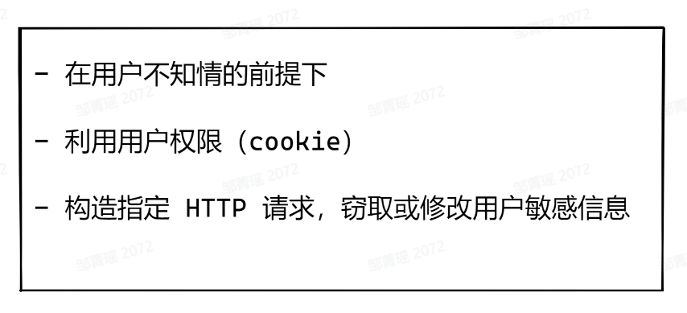

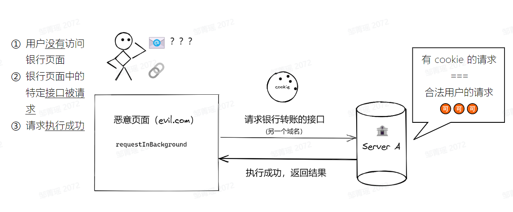

demo: 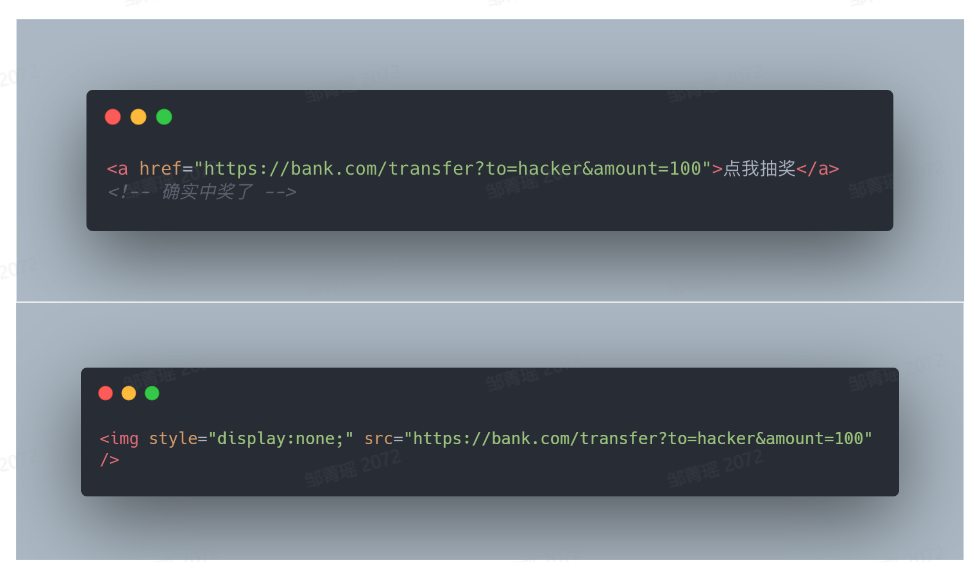

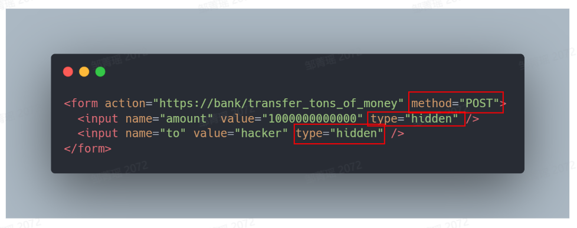

#### 防御

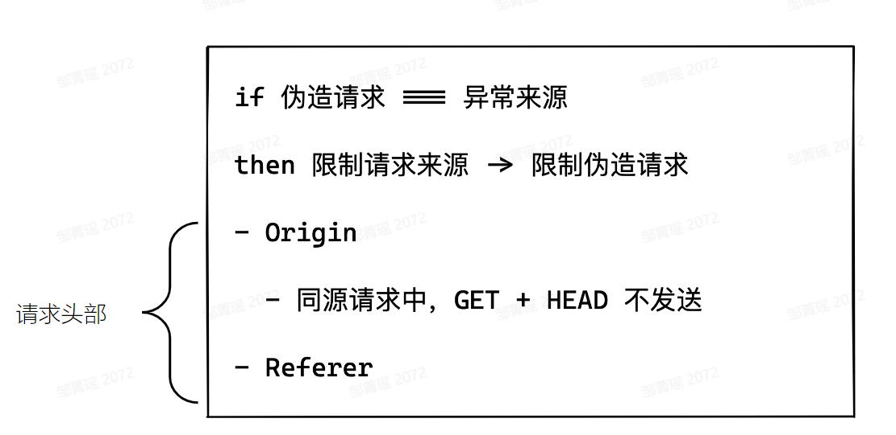

- Same Site Cookie；
- HTTP 请求头添加 Referer(Origin+页面路径，不包括锚点#)；
  - Referrer 是 HTTP 请求 header 的报文头，用于指明当前流量的来源参考页面，常被用于分析用户来源等信息，里面的信息是浏览器填的。
  - Referrer Policy 则是用于控制 Referrer 信息传不传、传哪些信息、在什么时候传的策略。

> 因为有些网站一些用户敏感信息，比如 sessionid 或是 token 放在地址栏里，如果当做 Referrer 字段全部传递的话，那第三方网站就会拿到这些信息，会有一定的安全隐患。\
> 所以就有了 Referrer Policy，用于过滤 Referrer 报头内容。\
> 例如使用 strict-origin-when-cross-origin 策略，含义是跨域时将当前页面的 URL 过滤掉参数及路径部分，仅将协议、域名和端口（如果有的话）当作 Referrer。\
> 否则 Referrer 还是传递当前页的全路径。同时当发生降级（比如从 https:// 跳转到 http:// ）时，不传递 Referrer 报头。

- token；
- 验证码，重要操作发送验证码；
