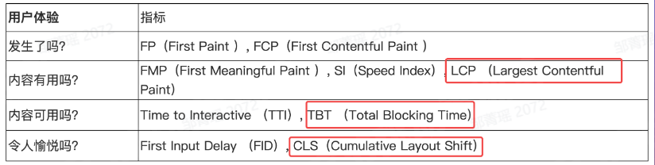

---
group:
  title: 实习八股
  path: /interview/internship/
---

# 通用问题整理

## chatGPT、GPT-4 对前端的影响

GPT-4 是 OpenAI 发布的多模态预训练模型，除了文字输入外，也支持图像、视频、音频等从多个角度出发对事物进行描述。 GPT-2 的参数总量是 15 亿，GPT-3 更是提高到了惊人的 1750 亿。

> 作为一个语言模型，我可以生成代码，但我不能像前端工程师那样编写实际的、可运行的代码。我生成的代码也不一定符合实际的代码规范和最佳实践。\
> 在前端开发中，编写代码只是其中的一部分。更重要的是，前端工程师需要理解和应用诸如算法、数据结构、设计模式、性能优化等计算机科学的原则和技术，以及深入了解特定的前端框架和库，才能编写出高效、可靠、易于维护的前端代码。

由图片生成 html 早就有了，比如蓝湖；目前来说，我认为它是辅助我们工作的，能够极大的提升效率，例如：

- 技术调研 + 文档编写阶段
- 编码阶段：工具方法
- 测试工具

如果有一些工作是重复的，可以交给机器的，我们也应该痛快的解放双手，把更多精力放在更值得的事情上。

对消息的实时观察，过滤，检索，分类，整理让我们很容易错过许多非常重要的信息，对于个人而言可能损失了很多机会，又或者降低了学习的效率，其本质是因为基于移动互联网时代，我们虽然和设备做了深度绑定，但我们的时间是有限的，一个人不可能 24 小时都挂在网上，同时我们也没有能力分身亿万，对所有东西都保持关注，但是 AI 带来了一种可能性未来，你可能拥有 N 个数字助手，这些数字助手都基于特定编程，能够帮你处理各种特定的事务，让你突破自身时间的限制。

微软 Copilot，将 AI 融入办公软件。

> 人类天生就梦想、创造、创新。但今天，我们花太多时间被繁重的工作所消耗，花在消耗我们时间、创造力和精力的任务上。为了重新连接我们工作的灵魂，我们不仅需要一种更好的方式来做同样的事情，更需要一种全新的工作方式。\
> 通过 Copilot，你的话就变成了地球上最强大的生产力工具。

## 低代码

优秀的编程思想，架构能力永远是稀缺资源。前端智能化。

低代码/无代码开发的核心技术，过去是“复用”，今天是 AI 驱动的“人机协同编程”。过去的低代码/无代码开发多围绕着提升研发效能入手，今天 AI 驱动的“人机协同编程”则是围绕着提升交付效率入手。

模板、拖拽、json->form；

## 为什么要做前端、为什么对前端感兴趣

业界趋势：前端技术是目前业界发展最快的领域之一，前端很有价值，直接决定了用户体验和交互的好坏，同时也影响着整个 Web 应用的性能和稳定性。有时候用户是否喜欢这个网站或 app 很大程度上取决于交互体验。例如横向长 tab 栏，自动居中。

大学的时候自学三大基础语言，仿淘宝的 web 端，做起来会忘记时间，不觉得枯燥；选择职业方向的时候潜意识会想选择大家口中更有发展前景的后端和算法；

更快地加载速度，更安全的系统，更好的用户体验。

细心和热情。

## 怎么学习前端

主动学习：书、社区、公众号（碎片学习、主动触达、自己选择）、知识付费（视频课程、专栏）；被动学习：实践中遇到问题。网络 -> 三大语言 -> git -> web 安全 -> 工程化（npm/yarn, less, eslint, prettier） -> react -> ts; echart;

## 前端性能优化

- [青训营-前端优化：首屏、渲染、JS优化](./../../youth-camp/container#前端优化)
- [前端性能优化 - 归纳篇](https://godbasin.github.io/front-end-playground/front-end-basic/performance/front-end-performance-optimization.html)

### 白屏原因

- js 错误 -> 关键资源渲染错误；
- 请求异常/静态资源加载失败；
- 长时间的 js 线程阻塞渲染任务；

### 监控
https://bytedance.feishu.cn/file/boxcnNzNFpkmdunBdMid61MMRAc

- Performance 和 PerformanceObserver 可以监控到一些标准的渲染性能数据；
  - 列举出性能指标对应的 entry type
    - fp,fcp --> paint
    - lcp --> largest-contentful-paint
    - fip --> first-input
- window.addEventListener 的 error 和 unhandledrejection，可以监控到全局 JS 的错误；
- window.addEventListener 的 error 事件，可以监控到静态资源错误；


## 前端发展

### [WebAssembly](https://juejin.cn/column/7210666370487681082)

> WebAssembly 是 W3C 标准化组织制定的一个可移植、体积小、加载快并且兼容 Web 的全新格式。\
> 利用 WebAssembly 技术可以方便地将非 JavaScript 代码快速地“运行”在浏览器中，从而为前端场景提供了无限可能；\
> 此外，随着 WebAssembly 在开发者社区中越来越流行，也正在成为服务端以及云计算平台上的新锐。

第 4 种 Web 语言。

### [PWA](https://juejin.cn/post/6844903517103063053)

Progressive Web App, 渐进式网页应用。

App 的缺点：

- 由于其天生封闭的基因，内容无法被索引
- 用户 80% 的时间被 Top3 的超级 App 占据，对于站点来说，应用分发的性价比也越来越不划算
- 要使用它，首先还需要下载几十兆上百着兆的安装包

Web 前端的缺点：

- 离线时用户无法使用
- 无法接收消息推送
- 移动端没有一级入口

为了将 Web 和 App 之长结合起来，W3C 和谷歌推出了 PWA; 目前豆瓣移动端和饿了么用了部分 PWA 技术。

## hr 面

### 字节工作

S: 我当时所在的小组是一个测试团队，测试工作有一个普遍的痛点就是有一些功能是需要反复测试的，拿淘宝这样一个购物软件来说，它的核心功能就是能下单和支付。 当淘宝发布新版本的时候，测试人员要保证两部分的功能正常：1. 新功能符合预期；2. 对以前的功能比如下单和支付重新测试，防止新功能对以前的核心流程造成影响。 T: 我在字节的主要工作就是改善这个痛点，将核心并且稳定的测试用例比如说下单和支付进行自动化，也就是通过编写脚本或程序，模拟人工测试的过程。 A: 为了达到这个目的，我主要做了两个方面的任务：

1. 我用云服务开发了一个数据构造机器人，集成到了飞书中，方便大家构造出各种各样的测试数据；
2. 将适合做自动化的、也就是功能稳定又重要的测试用例自动化了，大约有 300 个功能。 R: 这样每次发布新功能的时候，其他测试人员就只需要手动测新功能，对于以前的功能有没有受影响就可以简单的跑我写的程序进行测试。 节省了一定的人力成本，这样自动化程序找到的 bug 比例就提升了，比如原来 100 个 bug 中有 10 个是程序发现的，现在能有 20 个。

有什么难点：

1. 哪些功能需要自动化需要慎重考虑；自动化不是万能的，无法替代手工测试，对于短期上线的新功能手动测更快，成本更低，但是稳定的功能需要持续测试才值得花费人力去编写自动化用例。
2. 需要对业务有深刻的了解；自动化测试一旦编写好了，几乎不会再修改，所以要编写的足够鲁棒，如果后续还要频繁修改的话，那这个就不是好的测试用例。

### 链城工作

S: 需要快速加入元宇宙市场，打造一个数字藏品生态平台，简单来说平台要有数字藏品生态产品的发行、展示、宣传和购买等功能，包括管理端和客户端，管理端主要负责 c 端数据例如藏品、优惠券、发行时间等配置。 T: 我在其中负责部分页面的前端开发工作，在和各角色同学的有效沟通下完成页面的开发，在保证功能完备的前提下尽可能提升应用的安全和可维护性、用户的交互体验。 A: 除了前端日常开发工作 ，我也主动参与抽取可复用组件、页面模板。 R: 目前该项目是稳定迭代的过程中，前端项目代码本身也成了公司规范项目之一，研发效率的提升（多项目复用、团队协作规范）。

核心开发成员；

技术选型：

- 开始采用 Taro + Dva，是为了适配多端、快速迁移到各种小程序；
- 后面实际情况并不需要多端同构，基于项目的性状+团队的技术沉淀，决定切换成 React 技术栈上面来；

难点：

1. 组件嵌套层级多、状态和通信多，统一审视后对组件关系进行调整，避免多深层的组件嵌套；对于多层级的数据不会将数据和组件绑定在一起，而是让数据和组件脱离，进行数据的统一管理 Redux，context；

另外使用自定义 hooks 对于更细粒度的逻辑(状态逻辑、行为逻辑等)进行复用，把状态逻辑拆出来作为一个可复用的函数或组件（useBuyButton, CountDown）。

- 为什么采用 redux；有哪些数据流方法，为什么选择了这个；
- redux 的原理；

目前主流的数据管理流方案可以分为这三类：

- redux 流派 redux、和基于 redux 衍生的其他作品，以及类似 redux 思路的作品，代表作有 dva、rematch 等等。

- mobx 流派借助 definePerperty 和 Proxy 完成数据劫持，从而达到响应式编程目的的代表，类 mobx 的作品也有不少，如 dob 等。

- Context 流派这里的 Context 指的是 react 自带的 Context api，基于 Context api 打造的数据流方案通常主打轻量、易用、概念少，代表作品有 unstated、constate 等，大多数作品的核心代码可能不超过 500 行。

- 嵌套层级多，
  - 受控组件;
  - useContext + redux;
  - forwardRef(ref 转发) + useImperativeHandle，子->父通信, 联合使用暴露方法；

2. 动态权限路由：项目初始化的时候先获取权限列表，无权限的元素不展示；前端永远是不安全的，可以篡改的；还是需要后端来做鉴权；

菜单权限用动态添加路由addRoutes解决
有一个公共路由，登录后获取权限，得到需要动态添加的路由表，把路由添加到router里。实现方式是提前定义好完整的路由表，然后跟后台传输的权限做对比，过滤出一个路由权限表，再用addRoutes动态添加到路由里。然后根据过滤出的路由权限表渲染侧边栏。

- 权限控制--动态路由

  - admin: 请求菜单、过滤路由、在 BasicLayout 渲染菜单；
  - h5：动态底部 tab 栏配置；
```ts
/**
 * 权限校验
 * @param pathname 当前路由，即location.pathname
 * @param menus filter后的菜单
 */
function authorizedRoute(pathname, menus) {
  return menus?.find((menuItem) => {
    if (Array.isArray(menuItem.routes) && menuItem.routes.length > 0) {
      return authorizedRoute(pathname, menuItem.routes);
    }
    return pathname === '/' || (menuItem.path !== '/' && pathname.startsWith(menuItem.path));
  });
}
```
难点：
1. 对于系统配置页，是叶子菜单，但path和根路由一样都是'/'，所以走到系统配置这个叶子时，根据上面的判断，所有路由都是有权限的了；因此要加上`menuItem.path !== '/'`
2. 二级页面有部分权限，没过滤掉；所以要递归遍历找到叶子节点的菜单项，再去做匹配判断`pathname.startsWith(menuItem.path)`
3. 当location在根路由下时，直接返回true；

- 运维相关：absolute-redirect，[子页面刷新后 301 错误跳转至 fallback-404 页面](https://zhuanlan.zhihu.com/p/84539204);
使用history模式后访问内容页，刷新会404，需要后端重定向配置服务器。
  - 问题查找
    - 301 Moved Permanently 后返回的 Location 字段是通过 ngnix-conf 配置的，涉及三个字段：
      - absolute-redirect，默认 on，从 conf 文件拼接绝对路径；
      - server-name-in-redirect，默认 on，从 conf 文件读取 server-name，改为 off 则读取 header-in-server；
      - port-in-redirect，默认 on，加入监听端口号，80/443 不加端口号；
    - absolute-redirect 默认为 on，采用绝对路径重定向；
    - listen：80，监听 80 端口；
  - 解决
    - absolute-redirect: off;

- 倒计时校验问题；从客户端返回时间差；

- 性能相关，静态字体 fontmin 压缩，9.3MB -> 38KB；

- 立即抢购按钮，状态样式很多，自定义抽取 hooks；

- 组件开发：
  - 表单组件的设计，包括表单项联动、子表单、布局等；
  - 表格组件的设计，包括数据展示、筛选、排序、搜索等；
  - 跨页面数据传输，最典型的就是点击表格的某一行，跳转到一个表单页，数据回填上；
  - 数据容器组件，这个组件比较特殊，内部的组件都能够访问到该组件绑定的数据；

### 反问
想了解下财保事业群技术团队的架构和入职之后会在哪个具体的项目组，具体项目组的人员规模？
转正的流程；
你认为团队的工作氛围怎么样呀，在工作之外会不会组织技术分享交流会之类的；

### 加班

我认为不管是在什么领域，想要比别人做得好，就要付出额外的努力。加班也可以说是一种从量表到质变的积累过程，对我来说，我也希望自己能在职业的黄金期多做一些，多接触一些；但我也希望自己的加班都是有效和双赢的，而不是对公司资源的浪费。

我自我介绍有提到自己喜欢计算机行业，不是表面的，我知道这个行业光鲜亮丽的一面在哪里，我也清楚地知道这个行业有需要持续学习的这种特有属性，可以说是高压的一面，然后长久得和计算机打交道，会有枯燥地一面。

### 优缺点

优点：我认为自己有比较强的学习和适应能力，从我的两段经历来说，都是从一个基本零经验的程度开始，然后快速学习相关技术，上手业务，我认为自己是有短时间内掌握所需技能和融入公司和团队的能力。缺点：从小到大我其实有很多缺点，但是我这人还有一个优点就是我很善于反省自己，如果有他人给我提出意见，我会思考后努力改改改。最近我发现自己最大的缺点就是在语言表达上，我认为自己要更多的思考沟通对象想要什么答案，而不是只顾着自己输出。

### 最大的挫折

那应该是我大三时候的一段经历，当时想要保研，保研对绩点的要求很高，对每一门课都需要付出百分百的努力；但是有一门课程老师因为我在汇报文档中没有将源代码插入给了我很低的分数。当时挺郁闷的，三年来我在每一门课上做的努力可能会因为这一门成绩而白费。但是我没有陷入这种情绪中，我立马开始想有没有补救措施，首先问老师原因防止其他课程再遇到同样的处境；然后我更精细地准备剩下课程的汇报。

### 职业规划

我的未来职业规划是技术路线，三年内吧，我想要成为一个好用的人，能承担更多的团队工作；五年内，我想成为团队中的中流砥柱。具体来说，前三年，我想专注于 web 领域，尽可能多地吸收相关技术、积累更多的项目经验；在 pc 端之外，了解服务端和 native 移动应用开发。五年内，我希望自己在例如工程化、性能优化、低代码等方面有足够的技术沉淀，有能力主导一个业务模块并且提供完善的技术方案。

在职业过程中，我希望自己能一直保持好奇心，积极参与前端技术峰会，关注 web 标准组织的动态和行业的发展趋势。

### 前端行业趋势

https://juejin.cn/post/7069903591351255054#heading-31

从切图仔、写 HTML 模板的“石器时代”，到前后端分离、大前端的“工业时代”，再到现在跨端技术、低代码的“电气时代”。

1. 前端智能化
   - 低代码：使用拖放式组件和模型驱动逻辑来创建 web 和移动应用；
   - 代码自动生成：AI 将手稿 -> html 代码；比如 GPT-4;
2. 大前端（泛前端）
   - serverless
   - 全栈
   - devOps
   - 微前端
   - 小程序
   - 5G 时代：Web3D, WebRTC (Web Real-Time Communications)
