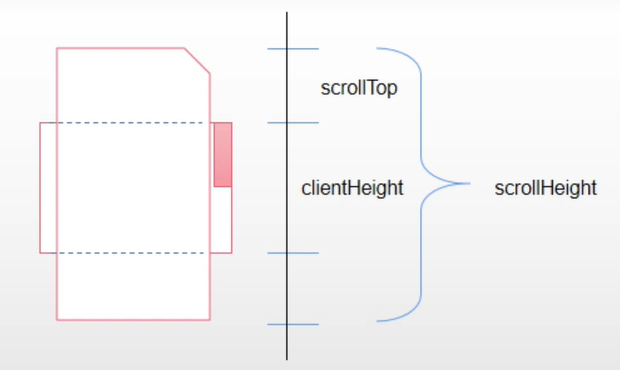

---
group:
  title: 实习八股
  path: /interview/internship/
---

# 概念（待学习）

- 插件开发
- 移动端开发
- 抽象语法树（AST）
- 网站性能优化
- NodeJs 开发经验
- Ajax 开发经验

## 尝试回答

- 跨域解决方案
- 缓存
- Cookie、Session
- 鉴权
- http/https/http2
- web 攻击

  - xss
  - csrf

- 路由
  - hash
  - history
- 事件循环
- react

  - 声明周期
  - hooks

- es6
  - 声明和表达式：let const 解构赋值 Symbol
  - 内置对象：Map 和 Set proxy 和 reflect
  - 字符串模板
  - 函数：参数扩展 箭头函数 迭代器 for of
  - class 类
  - export 和 import 模块
  - promise async await 和 generator
- 闭包
  - 节流防抖
- 性能：编译性能、监控、白屏检测、SEO、Service Worker 等了解
  - [可以做哪些性能优化](https://juejin.cn/post/7194400984490049573)
- canvas
- 判断图片即将进入可视区域：clientHeight+scrollTop>offsetTop

  - clientHeight: 获取屏幕可视区域的高度；
  - scrollTop：浏览器窗口顶部与文档顶部之间的距离，也就是滚动条滚动的距离
  - offsetTop：元素相对于文档顶部的高度； 

- 延迟若干时间执行代码并拿到返回值；

```javascript
function sleep(fn) {
  return new Promise((resolve) => {
    setTimeout(() => {
      let res = fn();
      resolve(res);
    }, 5000);
  });
}

function f() {
  return 1;
}

console.log(Date.now());
sleep(f).then((res) => {
  console.log(res, Date.now());
});
```

- [面试中的手撕函数](https://juejin.cn/post/7210979444760772664)
