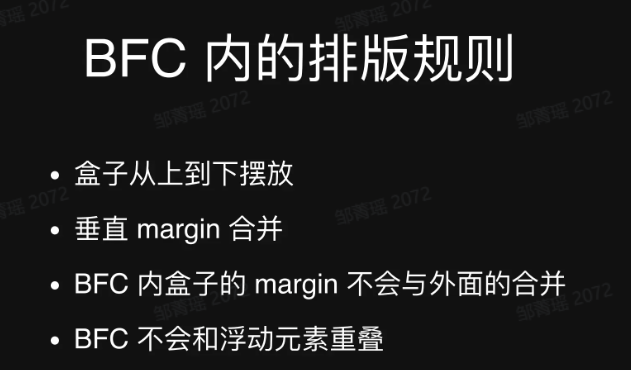

---
group:
  title: 实习八股
  path: /interview/internship/
---

# CSS

## 盒模型

通过`box-sizing`决定：

- `content-box`为标准盒子模型，`width = content`；要手动计算盒子的总宽度，开发麻烦；
- `border-box`为 IE 盒子模型，`witdh = content + padding + border`; 更常用，设置的 width 值就是盒子的宽度；

## BFC



形成一块独立的渲染区域；

- float 不设置成 none
- position 是 absolute 或者 fixed
- overflow 不是 visible （overflow: hidden 常用）
- display 是 flex 或者 inline-block 等

作用：

- 自适应两栏布局
- 阻止元素被浮动覆盖
- 清除内部浮动
- 阻止 margin 重叠
- 解决高度塌陷问题

## 单位

- px 是固定的大小；
- em 是相对于父元素字体的大小；
- rem 是相对于根元素字体的大小；
- vh、vw 是相对可视窗口（visual viewport）的大小；
- dpr: 设备像素比，物理像素/逻辑像素；即一个逻辑像素由几个物理像素描绘；
- 屏幕尺寸：对角线长度（英寸），1inch = 25.4cm; 常说的手机大小 6 寸，7 寸就是这个对角线长度；
- 屏幕分辨率、物理分辨率或设备分辨率：指屏幕展示的像素点，以 iPhone6 为例，其屏幕分辨率为 750 x 1334，指的是屏幕水平有 750 个像素点，垂直有 1334 个像素点。
- ppi, 像素密度，指的是每英寸（水平或垂直方向）有几个像素点，例如，iPhone6 屏幕宽度为 2.3 英寸，高度为 4.1 英寸，其屏幕像素密度就等于 750 / 2.3 = 326 或 1334 / 4.1 = 326。

## 移动端适配方案

- 媒体查询，使用 css 的@media 使用不同的样式文件或样式属性；
- 动态 rem 方案（xysc 方案）
  - 元素大小以根元素字体大小（一般为 37.5px）决定，即让根元素字体大小跟随屏幕宽度的变化成比例缩放；
  - 使用步骤：
    - meta 标签设置 viewport 宽度为屏幕宽度；
    ```html
    <meta
      name="viewport"
      content="width=device-width, initial-scale=1, maximum-scale=1, minimum-scale=1, user-scalable=no,viewport-fit=cover"
    />
    ```
    - 根据不同屏幕修改根元素 font-size 大小，一般设置为屏幕宽度的十分之一（可引入 lib-flexible 库，或者自己写相应逻辑）；
    - 开发环境配置 postcss-px2rem 或者类似插件；
    - 根据设计稿写样式，元素宽高和字体大小直接取设计稿的值即可，单位为 px，插件会将其转换为 rem；
- viewport 方案
  > rem 方案其实是 viewport 的过渡方案，将设计稿除以 100，等分为 7.5 份来实现移动端不同屏幕尺寸适配；\
  > viewport 也是这种适配原理，之前 viewport 在浏览器上兼容性不好；但 rem 是字体单位，vm/vh 的语义化更好；
  - 使用步骤
    - meta 标签设置 viewport 宽度为屏幕宽度；
    - 开发环境配置 postcss-px-to-viewport 或者类似插件；
    - 根据设计稿写样式，元素宽高直接取设计稿宽高即可，单位为 px，插件会将其转换为 vw；
    - 段落文本也按照设计稿写，单位为 px，不需要转换为 vw；
- 固定的 viewport 方案，把可视窗口宽度设置为固定值，相当于整个页面进行缩放，在尺寸相差小的设备中适合。
