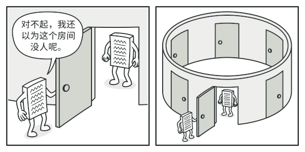
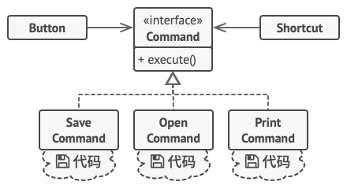
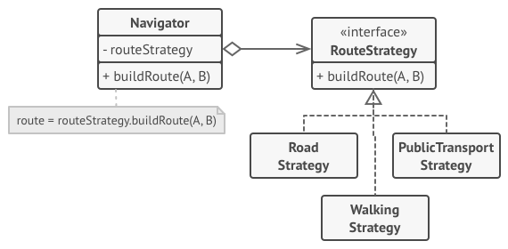

---
group:
  title: 实习八股
  path: /interview/internship/
---

# [设计模式](https://refactoringguru.cn/design-patterns/catalog)

> 设计模式是一套被反复使用的、多数人知晓的、经过分类编目的、代码设计经验的总结。使用设计模式是为了重用代码、让代码更容易被他人理解、保证代码可靠性。

## 创建者模式

> 创建型模式提供了创建对象的机制， 能够提升已有代码的灵活性和可复用性。

### 工厂方法

> 在父类中提供一个创建对象的方法， 允许子类决定实例化对象的类型。

先写一个抽象类和接口，具体的产品通过继承并实现必须要实现的方法，从而返回不同的产品，例如在 wins 和 linux 下的按钮。

- AbstractBtn
  - WinsBtn
  - LinuxBtn

### 抽象工厂

> 创建一系列相关的对象， 而无需指定其具体类。（通常基于一组工厂方法）

不光有不同的产品，每种产品还有不同的类型。例如 wins、linux、mac 下的控件。此时先创建一个抽象工厂，能返回不同的控件例如 btn, dialog 等；然后声明具体类型的工厂，例如 wins 工厂、linux 工厂、mac 工厂，这三个具体的工厂都要实现具体的返回不同空间方法。

- AbstractComponents
  - WinsComponents
  - LinuxComponents
  - MacComponents

使用的时候直接调用 AbstractComponents 中的 renderBtn，然后具体用哪个工厂一般是初始化决定的，例如识别用户是 mac 系统，就调用具体的 mac 工厂 MacComponents 的 renderBtn 方法；

### 生成者模式 Builder

> 能够分步骤创建复杂对象。 该模式允许使用相同的代码生成不同类型和形式的对象。

对于一个产品可能有多个可选项的情况，构造函数可能的参数非常多，可以将构造函数抽离出来生成构造器。例如房子类，是否带泳池，是否带阳台等可以放在生成器中，需要泳池再去调用具体的 buildSwimmingPool; 需要调用哪些具体的构造器方法，可以通过主管类来维护，也可以手动按一定顺序调用，单独抽出来更清晰，使用者只需要和主管交互。

- House
- HouseBuilder(构造函数抽离到 Builder 中)
  - buildSwimmingPool
  - buildGarden

### 原型模式

> 复制已有对象， 而又无需使代码依赖它们所属的类。

如果 A 想继承 B 的全部属性，让 A“主动”去继承可能很多私有属性看不到。原型模式将克隆过程委派给被克隆的实际对象，也就是让所有`可以被克隆的对象（即原型）`都实现一个通用接口，通常该接口只包含 copy 方法，让 B“主动交出所有细节”。

### 单例模式

> 能够保证一个类只有一个实例， 并提供一个访问该实例的全局节点。常用于控制某些共享资源 （例如数据库或文件） 的访问权限。 

## 结构型模式

> 将对象和类组装成较大的结构， 并同时保持结构的灵活和高效。

### 适配器

> 让接口不兼容的对象能够相互合作

创建一个特殊的对象 -- 适配器， 能够转换对象接口，使其能与其他对象进行交互。例如程序只接受 json 格式，但是数据来源都是 json 格式，可以创建一个 xml & json 的适配器。

### 桥接

> 可将一个大类或一系列紧密相关的类拆分为抽象和实现两个独立的层次结构

### 组合

> 你可以使用它将对象组合成树状结构，并且能像使用独立对象一样使用它们

### 装饰器

> 允许你通过将对象放入包含行为的特殊封装对象中来为原对象绑定新的行为

### 外观

> 能为程序库、框架或其他复杂类提供一个简单的接口

### 享元

> 摒弃了在每个对象中保存所有数据的方式，通过共享多个对象所共有的相同状态，从而在有限的内存容量中载入更多对象

### 代理

> 让你能够提供对象的替代品或其占位符。代理控制着对于原对象的访问，并允许在将请求提交给对象前后进行一些处理

## 行为模式

> 负责对象间的高效沟通和职责委派。

### 命令

> 将请求转换为一个包含与请求相关的所有信息的独立对象。 该转换让你能根据不同的请求将方法参数化、 延迟请求执行或将其放入队列中， 且能实现可撤销操作。

例如开发编辑器中，到处都可以点击，执行的操作不同。这种时候可以将命令抽象出来，然后各个按钮只需要存储对应命令的引用。 

### 迭代器

> 在不暴露集合底层表现形式 （列表、 栈和树等） 的情况下遍历集合中所有的元素。

将集合的遍历行为抽取为单独的迭代器对象。不管采用哪种遍历方式，通常提供 getNext()和 hasMore()方法;

### 观察者

> 允许定义一种订阅机制， 可在对象事件发生时通知多个 “观察” 该对象的其他对象。

也叫发布订阅模式。

### 策略

> 定义一系列算法， 并将每种算法分别放入独立的类中， 以使算法的对象能够相互替换。

## 前端设计模式概述

设计模式：指软件设计中常见问题的解决方案模型；历史经验的总结、和特定语言无关的；

### 浏览器中的设计模式

#### 单例模式

- 定义：全局唯一访问对象例如 Window；
- 应用场景：缓存、全局状态管理；

#### 发布/订阅模式

一种订阅模式，可以在被订阅对象发生变化时通知订阅者，例如 btn.addEventListener();

### JS 中的设计模式

#### 原型模式

- 定义：复制已有对象来创建新的对象；
- 应用场景：JS 中创建对象的基本模式；

#### 代理模式

- 定义：可自定义控制对原对象的访问方式，并且允许在更新前后做一些额外处理；
- 应用场景：监控、代理工具、前端框架实现等等。

#### 迭代器模式

- 定义：在不暴露数据类型的情况下访问集合中的数据；
- 应用场景：数据结构中有多种数据类型：列表、树等，提供通用操作接口。
