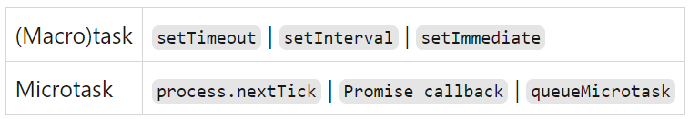

---
group:
  title: 实习八股
  path: /interview/internship/
---

# JS

- [JS - 阮一峰](https://wangdoc.com/javascript)
- [ES6 - 阮一峰](https://es6.ruanyifeng.com/#docs/function#%E7%AE%AD%E5%A4%B4%E5%87%BD%E6%95%B0)

## OOP

面向对象编程；

### this

> JavaScript 语言之中，一切皆对象，运行环境也是对象，所以函数都是在某个对象之中运行，this 就是函数运行时所在的对象（环境）。这本来并不会让用户糊涂，但是 JavaScript 支持运行环境动态切换，也就是说，this 的指向是动态的，没有办法事先确定到底指向哪个对象，这才是最让初学者感到困惑的地方。

内层的 this 不指向外部，而指向顶层对象，应该避免多层嵌套 this。

JavaScript 提供了 call、apply、bind 这三个方法，来切换/固定 this 的指向。

- call

```javascript
var obj = {};

var f = function () {
  return this;
};

f() === window; // true
f.call(obj) === obj; // true
```

- apply: 与 call 方法类似，也是改变 this 指向，然后再调用该函数。唯一的区别就是，它接收一个数组作为函数执行时的参数原函数的参数，在 call 方法中必须一个个添加，但是在 apply 方法中，必须以数组形式添加。

```javascript
function f(x, y) {
  console.log(x + y);
}

f.call(null, 1, 1); // 2
f.apply(null, [1, 1]); // 2
```

- bind: 用于将函数体内的 this 绑定到某个对象，然后返回一个新函数。

```javascript
var counter = {
  count: 0,
  inc: function () {
    this.count++;
  },
};

var func = counter.inc.bind(counter);
func();
counter.count; // 1s
```

让执行 func 和直接 counter.inc 达到同样效果，用 bind 可以实现；

5 种 this 的绑定方式的优先级如下：

> 箭头函数 -> new 绑定 -> 显示绑定 call/bind/apply -> 隐式绑定 -> 默认绑定

## [Scoping & Hoisting](https://developer.mozilla.org/zh-CN/docs/Glossary/Hoisting)

在 `chaincity` 的前端[文档](../../prog-spec/javascript#hoisting)中也提到过这个概念，

> “变量提升”意味着变量和函数的声明会在物理层面移动到代码的最前面，但这么说并不准确。实际上变量和函数声明在代码里的位置是不会动的，而是在编译阶段被放入内存中。

变量(var)和函数的**声明**会被提前（只记这一句就行，别去想声明、初始化、使用顺序什么的）；另外函数会比变量放在更前面。

但是有个小区别：变量只有声明会提前，函数的函数体也会提前：

```javascript
console.log(y); // 'undefined'
var y = 2; // 声明 + 初始化 y
```

对于函数:

```javascript
catName('Chloe');

function catName(name) {
  console.log('我的猫名叫 ' + name);
}

/*
代码执行的结果是："我的猫名叫 Chloe"
*/
```

但如果是 var funcA = function(){}的形式，就和变量是一样的，也算是变量赋值。

---

还是没理解，看这个[文章](http://www.adequatelygood.com/JavaScript-Scoping-and-Hoisting.html)试试：

首先要理解 **JS Scoping**：

JS 中有三种类型的作用域：

- global scope
- module scope
- function scope 另外，let 和 const 属于一个另外的作用域：
- block scope：花括号包裹的例如 if 等

```javascript
var x = 1;
let y = 1;

if (true) {
  var x = 2;
  let y = 2;
}

console.log(x);
// Expected output: 2

console.log(y);
// Expected output: 1
```

迷惑的点在于习惯了 c 家族语言和 java 等的块作用域，if 等也会创造一个新块；

JS 和它们不同，对于 var 来说没有块作用域，下面的例子中只有全局和函数级作用域，函数创造了新的域 scope；

```text
var foo = 1;
function bar() {
	if (!foo) {
		var foo = 10;
	}
	alert(foo);
}
bar();
```

最终会 alert(10)，这是因为在 bar 函数（新的 scope）中，有 var foo 声明（在这个 scope 中覆盖了 globle foo），会提升至 bar 的第一行，所以!foo 成立；

看下面这两个其实等价的函数：

```javascript
function foo() {
  if (false) {
    var x = 1;
  }
  return;
  var y = 1;
}
function foo() {
  var x, y;
  if (false) {
    x = 1;
  }
  return;
  y = 1;
}
```

### [var, let, const](https://www.freecodecamp.org/news/var-let-and-const-whats-the-difference/)

- var 是全局、函数作用域，可以被 re-declare，var 声明会提升至作用域顶部并且初始化为 undefined；
- let 是全局、函数、块作用域，不可以被 re-declare(error: Identifier 'xx' has already been declared)，let 声明会提升至作用域顶部但不初始化，所以在声明前使用会得到 Reference Error；
- const 也是全局、函数、块作用域，不能 update 和 re-declare，必须给初始化，除了是常量外和 let 基本一致；

## [Event bubbling & capturing](https://javascript.info/bubbling-and-capturing)

事件处理有三个步骤：

- capturing phase；
- target phase(被点击的最小标签为 event.target)；
- bubbling phase；

平时很少关注 capturing 阶段，通过`elem.addEventListener(..., {capture: true})`第二个参数开启。好有意思，和 bubbling 顺序是反着的，从 html 元素到被点击的元素依次 capture，然后反向从内到外触发 bubble。

可以通过 event.eventPhase 获取当前阶段： capturing=1, target=2, bubbling=3；

- 会冒泡的事件：⿏标事件，和键盘事件，以及点击事件支持冒泡；
- 不冒泡的事件：例如聚焦和失焦事件，加载事件，ui 事件、⿏标移⼊移出事件是不支持冒泡的。

### 事件委托

一种利用事件冒泡的事件执行机制，例如很多子节点都需要绑定相同的事件处理机制，那可以将事件绑定到它们最近的父元素上。

## [Inheritance and Prototype Chain](https://developer.mozilla.org/zh-CN/docs/Web/JavaScript/Inheritance_and_the_prototype_chain)

> JavaScript 只有一种结构：对象。每个实例对象（object）都有一个私有属性（称之为 **proto**）指向它的构造函数的原型对象（prototype）。该原型对象也有一个自己的原型对象（**proto**），层层向上直到一个对象的原型对象为 null。

可以通过`Object.getPrototypeOf()`或者某对象的原型对象；查找属性时，顺着原型链往上找。

```javascript
// 让我们从一个函数里创建一个对象 o，它自身拥有属性 a 和 b 的：
let f = function () {
  this.a = 1;
  this.b = 2;
};
/* 这么写也一样
function f() {
  this.a = 1;
  this.b = 2;
}
*/
let o = new f(); // {a: 1, b: 2}

// 在 f 函数的原型上定义属性
f.prototype.b = 3;
f.prototype.c = 4;

// 不要在 f 函数的原型上直接定义 f.prototype = {b:3,c:4};这样会直接打破原型链
// o.[[Prototype]] 有属性 b 和 c
//  (其实就是 o.__proto__ 或者 o.constructor.prototype)
// o.[[Prototype]].[[Prototype]] 是 Object.prototype.
// 最后 o.[[Prototype]].[[Prototype]].[[Prototype]] 是 null
// 这就是原型链的末尾，即 null，
// 根据定义，null 就是没有 [[Prototype]]。

// 综上，整个原型链如下：

// {a:1, b:2} ---> {b:3, c:4} ---> Object.prototype---> null

console.log(o.a); // 1
// a 是 o 的自身属性吗？是的，该属性的值为 1

console.log(o.b); // 2
// b 是 o 的自身属性吗？是的，该属性的值为 2
// 原型上也有一个'b'属性，但是它不会被访问到。
// 这种情况被称为"属性遮蔽 (property shadowing)"

console.log(o.c); // 4
// c 是 o 的自身属性吗？不是，那看看它的原型上有没有
// c 是 o.[[Prototype]] 的属性吗？是的，该属性的值为 4

console.log(o.d); // undefined
// d 是 o 的自身属性吗？不是，那看看它的原型上有没有
// d 是 o.[[Prototype]] 的属性吗？不是，那看看它的原型上有没有
// o.[[Prototype]].[[Prototype]] 为 null，停止搜索
// 找不到 d 属性，返回 undefined
```

通过`Object.create(obj)`创建继承自对象`obj`的对象；函数有 prototype 属性，带默认构造函数；

## [Event Loop](https://dev.to/lydiahallie/javascript-visualized-event-loop-3dif)

JS 是单线程的，在同一时刻只能执行一个任务。还好浏览器提供了 Web API，包括:

- DOM API;
- setTimeout;
- HTTP 请求；
- ...

当调用函数时，这个调用会被压入调用栈中，调用栈是 JS 引擎提供的。

对于 setTimeout 来说：

- 它会在时间到后被放入队列中（不是调用栈），而不是时间到就立刻能执行，要在队列中等待被调用；
- 当调用栈为空时，会从队列中取出第一个函数压入栈，也就是 event loop，循环栈、队列执行事件；

另外，JS 通过 Promise 也提供了异步执行代码的能力，所以事件循环中的队列有两种类型：

- 宏队列
- 微队列

常见的任务分类如下： 

可以看到 Promise 回调也不是立刻执行的，会放到微队列中；

事件执行顺序：调用栈、微队列、宏队列。

一个小例子：

```javascript
const first = () =>
  new Promise((resolve, reject) => {
    console.log(3);
    let p = new Promise((resolve, reject) => {
      console.log(7);
      setTimeout(() => {
        console.log(5);
        resolve(6);
      }, 0);
      resolve(1);
    }); // p成功, value = 1
    resolve(2); // first()成功, value = 2
    p.then((arg) => {
      console.log(arg);
    });
  });

first().then((arg) => {
  console.log(arg);
});

console.log(4);
```

.then(1).then(2) 1 推进队列后，2 不进队列；1 执行了才会把 2 推进队列，注意推的时机；**执行器执行完了**才会推回调（回调回调，执行器执行完了的回调函数）；

```javascript
const p1 = new Promise((resolve) => {
  setTimeout(() => {
    resolve('resolve3');
    console.log('timer1');
  }, 0);
  resolve('resovle1');
  resolve('resolve2');
})
  .then((res) => {
    console.log(res);
    setTimeout(() => {
      console.log(p1);
    }, 1000);
  })
  .finally((res) => {
    console.log('finally', res);
  });
```

`then`和`catch`会返回一个新的`Promise`实例，`finally`获取的是前一个`Promise`的值，本例中`finally`中的`res`是`then`返回的`Promise`的值，因为`then`没有返回值，所以`finally: undefined`;

输出顺序：`resolve1, finally undefined, timer1, Promise(fulfilled, undefined)`;

### Async/Await

在执行异步函数时，遇到 await 语句首先会执行其等待的 Promise 返回值，等这个 Promise resolved 时 JS 引擎就遇到了 await 关键词，当遇到 await 关键字时，async 函数将被挂起。函数体的执行将被暂停，异步函数的其余部分会被放到微队列中。

理解下面这个例子： 

- 首先输出"Before function";
- 然后进入异步函数 myFunc，输出"In function";
- 然后等待 one 返回值，执行 one，返回一个 resolved，value = One 的 Promise;
- Promise 返回后 JS 引擎看到了 await 关键词，于是把 myFunc 的执行挂起，其余部分放入微队列中；
- 执行最后一行，输出"After function"；
- 调用栈空，执行微队列中的任务，即 myFunc 的剩余部分，输出 res 的值"One!"

## 判断数据类型

### typeof

typeof 返回基本数据类型的字符串形式；

- 对于引用类型返回 object，例如数组、null、对象；
- 目前能返回 string，number，boolean，symbol，bigint，undefined，object，function 这⼋种判断类型；

### instanceof

`a instanceof A`，返回`Boolean`；

通过查找目标对象的原型链来判断引用数据类型的，不能判断基本类型；主要的作⽤就是判断⼀个实例是否属于某种类型

### Object.prototype.toString.call

返回的类型格式为[object,xxx]，xxx 是具体的数据类型，能返回包括 String，Number，Boolean，Undefined，Null，Function，Date，Array，RegExp，Error，HTMLDocument… 基本上所有对象的类型都可以通过这个⽅法获取到；

## 箭头函数

- 无法使用 arguments 对象，需通过剩余参数(rest parameters)或默认参数来获取传递给函数的参数列表；
- 无法使用 new 关键字调用函数，箭头函数没有自己的 this 值，它会捕获其所在的上下文中的 this 值；
  > 箭头函数不能作为构造函数的原因是因为箭头函数没有自己的 this 值，而是从定义时的词法环境中继承 this 值，也就是说，箭头函数中的 this 值是在定义时确定的，不能通过 new 关键字来改变 this 的指向。而构造函数中，this 的指向是随着实例化对象而改变的，因此箭头函数不具备构造函数的特性，不能用来创建对象。如果在箭头函数中使用了 new 关键字，会抛出一个 TypeError 错误。
- 无法使用 yield 关键字，因此箭头函数不能用作 generator 函数；
- 箭头函数没有自己的作用域，它会捕获所在上下文的作用域链(scope chain)，因此对于闭包的使用需要特别注意。需要注意的是，虽然箭头函数有一些限制，但在很多情况下它们能够简化代码，提高可读性和可维护性，特别是在函数式编程和 React 等框架中得到了广泛的应用。

## Ajax, Fetch, Axios

### Ajax

`Asynchronous JavaScript And XML`，即“异步的 Javascript 和 XML”；重要特性时实现页面的局部刷新。

利用 XMLHttpRequest 模块实现 http 请求，是 Ajax 的一种实现方式。

```javascript
function ajaxReq(url) {
  const xhr = new XMLHttpRequest();
  // 与服务端建立连接, 参数分别表示请求的类型、URL 以及是否异步处理请求
  xhr.open('GET', url, true);
  // 请求内容的编码类型
  ajax.setRequestHeader('Content-type', 'application/x-www-form-urlencoded');
  xhr.send(null);
  xhr.onreadystatechange = function () {
    if (xhr.readyState === 4 && ((xhr.status >= 200 && xhr.status < 300) || xhr.status === 304)) {
      console.log('resp: ', xhr.response);
    }
  };
}
```


[XMLHTTPRequest - readyState 含义](https://developer.mozilla.org/en-US/docs/Web/API/XMLHttpRequest/readyState) ,返回`XMLHttpRequest`当前的客户端状态

- 0: UNSENT，代理被创建，但尚未调用 open() 方法；
- 1: OPENED，已经调用 open() 方法；
- 2: HEADERS_RECEIVED, send() 方法已经被调用，并且头部和状态已经可获得；
- 3: LOADING，下载中；responseText 属性已经包含部分数据；
- 4: DONE，下载操作已完成。

### Fetch

Fetch 是一个基于 ES6 promise 的真实存在的 API 。

通常所说的 Ajax 是指使用 XMLHttpRequest 实现的，所以`Fetch`更应该和`XMLHttpRequest`而不是`ajax`作比较。

```javascript
fetch(url)
  .then((res) => res.json())
  .then((data) => {
    console.info(data);
  });
```

### Axios

基于 promise 封装的网络请求库，它是基于 XHR 进行二次封装。

```javascript
// 发送 POST 请求
axios({
  method: 'post',
  url: '/user/12345',
  data: {
    firstName: 'Fred',
    lastName: 'Flintstone',
  },
});
```

### 总结

- ajax: 一种技术统称，主要利用 XHR 实现网络请求;
- fetch: 具体 API，基于 promise，实现网络请求;
- Axios: 一个封装库，基于 XHR 封装，较为推荐使用;

## 防抖节流

防抖是可以一直触发，但是单位时间内只响应最后的操作；节流是单位时间内只能触发一次；

### 防抖

> 单位时间内多次触发，只执⾏最后的那⼀次，原理：延迟执⾏，期间但凡有新的触发，就重置定时器

操作后延迟若干时间再执行，如果继续操作，就一直重置定时器，直到某次操作后停止操作了 delay 时间间隔；

```javascript
function debounce(fn, delay) {
  let t = null; // 定时器
  return function () {
    if (t !== null) {
      // 之前的计时还没结束，频繁触发
      clearTimeout(t);
    }
    // 没在计时，开始计时，delay后执行操作
    t = setTimeout(() => {
      fn.call(this);
    }, delay);
  };
}
```

### 节流

> 单位时间只触发⼀次，原理：上锁，只有满⾜⼀定间隔时间才能执⾏;

```javascript
function throttle(fn, delay) {
  let lock = false; // 初始状态：未上锁
  return function () {
      // 延迟执行，冷却中不处理
      if (lock) return ;
      // 没上锁就给它锁上delay时间后执行函数并解锁
      lock = true;
      setTimeout(() => {
          fn.call(this);
          lock = false;
      }, delay);
  };
}
```

## JS 异步解决方案

### callback

> 回调函数就是一个被作为参数传递的函数。说的通俗点就是，当一个函数 A 作为参数，被传入另一个函数 B 中，并且它不会立刻执行，而是只有当满足一定条件后函数 A 才可以执行，那么像 A 这种函数就称为回调函数。

- 回调函数的三个特点（箭头函数就是回调函数）：

1. 用户定义的函数
2. 非用户调用的函数
3. 一定会执行的函数

- 回调函数的分类：

1. 同步回调：立即执行，例如数组相关的回调函数、Promise 的 Executor
2. 异步回调：放入回调队列中等待执行，例如定时回调、ajax 回调、Promise 的成功/失败的回调

- 错误处理

1. 抛出错误：throw error
2. 捕获错误：try{}catch(Error){}

- 错误信息

1. message 属性：错误相关信息
2. stack 属性：函数调用栈记录信息

- 优点：异步编程最基本的方法，其优点是简单、容易理解和部署；
- 缺点：不利于代码的阅读和维护，各个部分之间高度耦合(Coupling)，容易造成回调地狱；

### 事件监听 / 发布订阅

> 采用事件驱动解决异步，任务的执行不取决于代码的顺序，而取决于某个事件是否发生;

- 优点：发布订阅模式实现的事件监听比较符合模块化思想；
- 缺点：整个程序变成了事件驱动，每次使用还得注册事件监听再进行触发挺麻烦的，对于解决异步问题来说有更合适的方式；

### Promise

用同步的方式写异步的代码;

- promise 特点：

1. JS 中进行异步编程的新解决方案，ES6 规范；
2. 语法上：Promise 是一个构造对象；
3. 功能上：Promise 对象用来封装一个异步操作，可以获取其成功和失败的结果；

- promise 的优势：

1. 指定回调方式更灵活：原来必须在启动异步任务前指定好成功和失败的回调函数，没指定则拿不到异步任务的结果了；有了 promise 之后，异步任务对应一个 promise 对象，，可以在任何时候指定其回调。
2. 支持链式调用，解决回调地狱问题。回调函数多层嵌套不利于阅读和异常处理， 解决方案：promise 链式调用，终极解决方案：async 和 await。

- 缺点
- Promise 对象一旦新建就会立即执行，无法中途取消；
- 若不设置回调函数，Promise 内部会抛出错误，不会流到外部；
- 当处于 pending 状态时，无法得知当前处于哪一阶段；

### [Generator](https://es6.ruanyifeng.com/#docs/generator-async)

见下一节 ES6-promise

> Generator 是协程在 ES6 的实现，最大的特点就是可以交出函数的执行权，可以通过 yield 关键字把函数的执行流挂起，为改变执行流程提供了可能，从而为异步编程提供解决方案;

- 优点：优雅的流程控制方式，可以让函数可中断执行，在某些特殊需求里还是很实用的
- 缺点：Generator 函数的执行必须靠执行器，所以才有了 co 函数库，但 co 模块约定，yield 命令后面只能是 Thunk 函数或 Promise 对象，只针对异步处理来说，还是不太方便；

### Async / Await

> ES2017 标准引入了 async 函数，是 Generator 的语法糖；

- 优点：

1. 内置执行器， async 函数自带执行器；
2. 更好的语义，async 和 await，比起 \* 和 yield，语义更清楚了，async 表示函数里有异步操作，await 表示紧跟在后面的表达式需要等待结果；
3. 更广的适用性，co 函数库约定，yield 命令后面只能是 Thunk 函数或 Promise 对象，而 async 函数的 await 命令后面，可以跟 Promise 对象和原始类型的值(数值、字符串和布尔值，但这时等同于同步操作)

- 缺点：滥用 await 可能会导致性能问题，因为 await 会阻塞代码，导致代码失去了并发性

## ES6

- 新增关键词 let, const，有了块级作用域；
- 异步编程能力: Generator, Async/Await
  - ES6 之前的异步方法：
    - 回调函数：回调地狱
    - Promise 对象：callback 的改进，只是写法用 Promise 和 then 包裹，但是语义都不清晰了全是 then；
    - 事件监听
    - 发布/订阅

### Generator

> 最大的特点就是可以交出函数的执行权（即暂停执行）。

在 function 关键字后面加\*表明是一个生成器函数，该函数返回的是一个迭代器对象，可以把它看成状态机，内部有很多状态。通过调用`next()`方法，遍历其内部的每一个状态，内部的`yield`就是暂停标志，最后的返回值是 return 后面的值或者是 undefined。

```js
function* gen() {}
var g = gen();
g[Symbol.iterator]() === g; // true
```

#### `next()`方法

将 yield 表达式替换成一个值。

- 返回值为`{value: xxx, done: true/false}`; 每次调用该方法，都会从上次的 yield 语句开始执行，直到遇到下一个 yield，yield 后面的值就是返回中 value 的值；
- 可以带参数，会作为上一个 yield xxx 的返回值，也就是可以在 Generator 函数的不同阶段，从外部注入值。

```js
function* demo() {
  console.log('Hello' + (yield));
}
const g = demo();
g.next(); // { value: undefined, done: false }
g.next(' jingyao'); // { value: 'Hello jingyao', done: true }
```

通过 value 和 next 的参数实现了内外数据交换。

#### `throw()`方法

将 yield 表达式替换成一个 throw 语句。

throw 也可以带参数（最好是 Error 的实例），也可以理解成也是 yield 的返回值，只不过是一个错误，所以可以被内部的 catch 语句捕捉；内部无 catch 语句，那函数体外部能捕捉到这个异常。如果内外都没写 catch，那会报错 Uncaught xxx。

```js
var g = function* () {
  try {
    yield;
  } catch (e) {
    console.log('内部捕获', e);
  }
};

var i = g();
i.next();

try {
  i.throw('a');
  i.throw('b');
} catch (e) {
  console.log('外部捕获', e);
}
// 内部捕获 a
// 外部捕获 b
```

#### `return()`方法

将 yield 表达式替换成一个 return 语句。返回给定的值，并且终结遍历 Generator 函数。

但如果在 try...finally 中，只是终止当前块 try 下的代码执行，finally 还是会继续执行完。

```js
function* numbers() {
  yield 1;
  try {
    yield 2;
    yield 3;
  } finally {
    yield 4;
    yield 5;
  }
  yield 6;
}
var g = numbers();
g.next(); // { value: 1, done: false }
g.next(); // { value: 2, done: false }
g.return(7); // { value: 4, done: false }
g.next(); // { value: 5, done: false }
g.next(); // { value: 7, done: true }
```

#### yield\*

`yield*`表达式表明它返回的是一个遍历器对象。

在 Generator 内部调用另一个 Generator 函数用，yield\*可以帮助手动调用 next 直到这个状态机执行完成。有点递归的意思。

```js
let delegatedIterator = (function* () {
  yield 'Hello!';
  yield 'Bye!';
})();

let delegatingIterator = (function* () {
  yield 'Greetings!';
  yield* delegatedIterator;
  yield 'Ok, bye.';
})();

for (let value of delegatingIterator) {
  console.log(value);
}
// "Greetings!
// "Hello!"
// "Bye!"
// "Ok, bye."
```

其实就是一直调用该迭代器的 next，直到没有下一个状态，所以对于数组这种有`Symbol.iterator`的属性的也有类似效果。

#### 应用

- 用同步代码完成异步操作

```js
function* loadUI() {
  showLoadingScreen();
  yield loadUIDataAsynchronously();
  hideLoadingScreen();
}
var loader = loadUI();
// 加载UI
loader.next();

// 卸载UI
loader.next();
```

- 给对象或者数据部署 Iterator 接口
- 作为数据接口，提供类型数组的接口
- co 模块
  > co 模块其实就是将两种自动执行器（Thunk 函数和 Promise 对象），包装成一个模块。

两种方式进行控制流管理：

- 回调函数。将异步操作包装成 Thunk 函数，在回调函数里面交回执行权。
- Promise 对象。将异步操作包装成 Promise 对象，用 then 方法交回执行权。

### Module 导入模块

JS 没有模块化支持，在 ES6 之前，社区制定了一些模块加载方案，最主要的有 CommonJS 和 AMD 两种，前者服务于服务端，后者服务于浏览器。

#### CommonJS

> CommonJS 模块就是对象，输入时必须查找对象属性。

```js
// CommonJS模块
let { stat, exists, readfile } = require('fs');

// 等同于
let _fs = require('fs');
let stat = _fs.stat;
let exists = _fs.exists;
let readfile = _fs.readfile;
```

> 上面代码的实质是整体加载 fs 模块（即加载 fs 的所有方法），生成一个对象（\_fs），然后再从这个对象上面读取 3 个方法。这种加载称为“运行时加载”，因为只有运行时才能得到这个对象，导致完全没办法在编译时做“静态优化”。

#### ES6 Module

```js
import { stat, exists, readFile } from 'fs';
```

> 上面代码的实质是从 fs 模块加载 3 个方法，其他方法不加载。这种加载称为“编译时加载”或者静态加载，即 ES6 可以在编译时就完成模块加载，效率要比 CommonJS 模块的加载方式高。\
> 当然，这也导致了没法引用 ES6 模块本身，因为它不是对象。\
> 由于 ES6 模块是编译时加载，使得静态分析成为可能。有了它，就能进一步拓宽 JavaScript 的语法，比如引入宏（macro）和类型检验（type system）这些只能靠静态分析实现的功能。

自动采用严格模式，例如变量必须先声明再使用、顶层的 this 指向 undefined(即不应该在顶层使用 this);

- `export`语句

该语句输出的接口，与其对应的值是动态绑定关系，即通过该接口，可以取到模块内部实时的值。

```js
export var foo = 'bar';
setTimeout(() => (foo = 'baz'), 500);
```

上面代码输出变量 foo，值为 bar，500 毫秒之后变成 baz。这一点与 CommonJS 规范完全不同。CommonJS 模块输出的是值的缓存，不存在动态更新，

另外，`export default`命令用于指定模块的默认输出。显然，一个模块只能有一个默认输出，因此 export default 命令只能使用一次，所以默认导出时 import 可以不用花括号。

- `import`语句

import 命令输入的变量都是只读的，因为它的本质是输入接口。也就是说，不允许在加载模块的脚本里面，改写接口；且具有提升效果，会提升到整个模块的头部，首先执行。

#### ES6 Module vs CommonJS

JavaScript 现在有两种模块。一种是 ES6 模块，简称 ESM；另一种是 CommonJS 模块，简称 CJS。

CommonJS 模块是 Node.js 专用的，与 ES6 模块不兼容。语法上面，两者最明显的差异是：

- CommonJS 模块使用 require()和 module.exports
- ES6 模块使用 import 和 export。

在 Node.js 中，两种都可以用，但是不要混用，取决于 package.json 中的 type 字段(module/commonjs)，另外 es6 module 的文件后缀名为`.mjs`, CommonJS 的文件后缀名为`.cjs`;

主要区别：

- CommonJS 模块输出的是一个值的拷贝，ES6 模块输出的是值的引用。
- CommonJS 模块是运行时加载，ES6 模块是编译时输出接口。
- CommonJS 模块的 require()是同步加载模块，ES6 模块的 import 命令是异步加载，有一个独立的模块依赖的解析阶段。

## js 加载 async/defer

传统 HTML 网页中，浏览器通过<script>标签加载 JavaScript 脚本。默认情况下，浏览器是同步加载 JavaScript 脚本，即渲染引擎遇到<script>标签就会停下来，等到执行完脚本，再继续向下渲染。如果是外部脚本，还必须加入脚本下载的时间。浏览器允许通过`async`和`defer`进行脚本异步加载：

```html | pure
<script src="path/to/myModule.js" defer></script>
<script src="path/to/myModule.js" async></script>
```

二者区别：

> defer 与 async 的区别是：defer 要等到整个页面在内存中正常渲染结束（DOM 结构完全生成，以及其他脚本执行完成），才会执行；\
> async 一旦下载完，渲染引擎就会中断渲染，执行这个脚本以后，再继续渲染。\
> 一句话，defer 是“渲染完再执行”，async 是“下载完就执行”。\
> 另外，如果有多个 defer 脚本，会按照它们在页面出现的顺序加载，而多个 async 脚本是不能保证加载顺序的。

## 一些输出题

[TODO](https://github.com/lydiahallie/javascript-questions/blob/master/README.md)

### Promise.all() vs Promise.race();

- Promise.all() 接受 Promises 的列表或可迭代对象（例如：Array），并返回一个新的 Promise，当可迭代对象中的所有 Promise 都已 resolved，或者如果可迭代对象中的至少一个 promises 已被拒绝则返回 reject。 **当传递一个空的可迭代对象时，此方法（同步）返回一个 resolved 的 Promise**；
- Promise.race() 静态方法接受 Promise 的可迭代对象，并返回一个新的 Promise，一旦可迭代对象中的第一个 promise 已解决或拒绝，该 Promise 就会立即解决或拒绝。 **当传递的 iterable 为空时，返回的 promise 将永远挂起**。

[手写 Promise 的静态方法](https://juejin.cn/post/7069805387490263047)

- Promise.all()

```javascript
PromiseAll = function (promises) {
  return new Promise((resolve, reject) => {
    if (typeof promises[Symbol.iterator] !== 'function') {
      // 检查是否是可迭代类型
      // 拼接错误提示字符串，基本数据类型要把值也提示给开发者
      return reject(`Error: ${typeof promises} is not iterable!`);
    }
    let arr = [],
      count = 0;
    Array.from(promises).forEach((item, i) => {
      // Array.from(promises)取出所有可迭代对象
      Promise.resolve(item).then((res) => {
        arr[i] = res;
        count += 1; // 到这里说明异步执行完一个
        if (count === promises.length) resolve(arr);
      }, reject);
    });
  });
};
```

> `Array.from()` 方法对一个类似数组或可迭代对象创建一个新的，浅拷贝的数组实例。

### ES6 模板字符串

- 模板字符串在的“标签模板”功能；可以紧跟在一个函数名后面，该函数将被调用来处理这个模板字符串。如果模板字符里面有变量，就不是简单的调用了，而是会将模板字符串先处理成多个参数，再调用函数。

```javascript
let a = 5;
let b = 10;

tag`Hello ${a + b} world ${a * b}`;
// 等同于
tag(['Hello ', ' world ', ''], 15, 50);
```

### 驼峰下划线（正则）

- 下划线转驼峰

```javascript
function toHump(name) {
  return name.replace(/\_(\w)/g, function (all, letter) {
    return letter.toUpperCase();
  });
}
let a = 'a_b2_345_c2345';
console.log(toHump(a));
```

- 驼峰转下划线

```javascript
function toLine(name) {
  return name.replace(/([A-Z])/g, '_$1').toLowerCase();
}
let b = 'aBdaNf';
console.log(toLine(b));
```

- 在正则中复用()中捕获的则`\0, \1`等；在替换时候用`$&, $1, $2`等；
