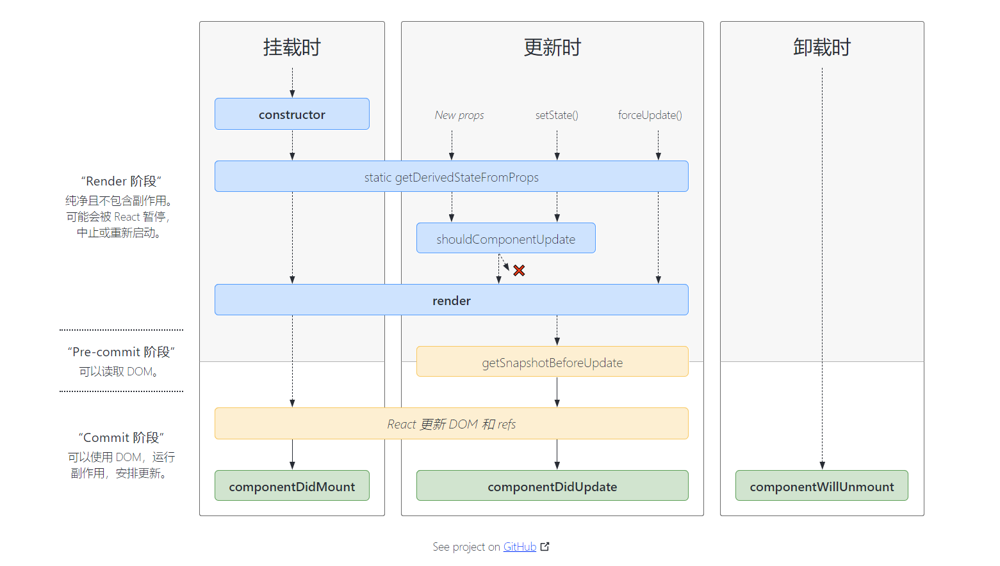
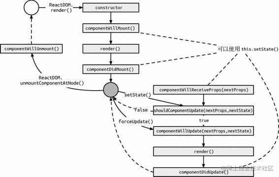
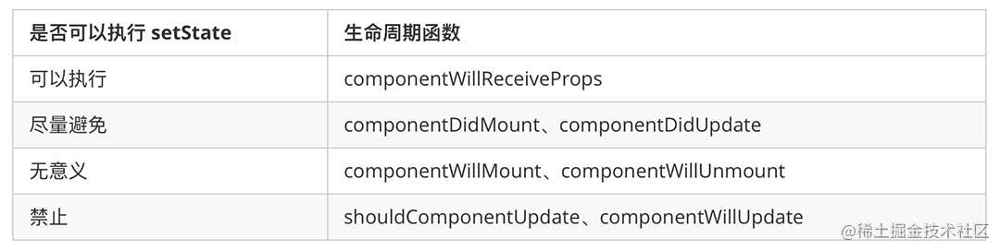
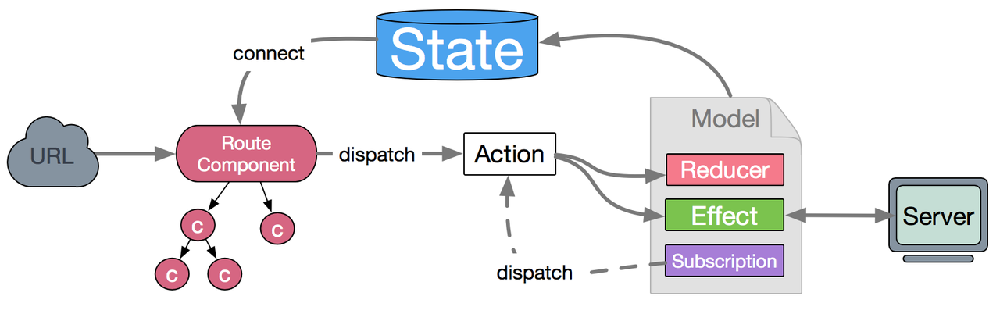

---
group:
  title: 实习八股
  path: /interview/internship/
---

# React

## [生命周期](https://projects.wojtekmaj.pl/react-lifecycle-methods-diagram/)

官方的图，好清晰！ 

分为挂载、更新、卸载三部分；

- 挂载：`constructor -> getDerivedStateFromProps -> render -> componentDidMount`
  - 在 React 组件挂载之前，会调用它的构造函数;
  - `render()` 函数应该为纯函数，这意味着在不修改组件 state 的情况下，每次调用时都返回相同的结果，并且它不会直接与浏览器交互。
  - `componentDidMount()` 会在组件挂载后（插入 DOM 树中）立即调用。依赖于 DOM 节点的初始化应该放在这里。如需通过网络请求获取数据，此处是实例化请求的好地方；也比较适合添加订阅。
- 更新：`getDerivedStateFromProps -> shouldComponentUpdate -> render -> getSnapshotBeforeUpdate -> componentDidUpdate`
  - `componentDidUpdate()` 会在更新后会被立即调用。首次渲染不会执行此方法。
- 卸载：`componentWillUnmount`
  - `componentWillUnmount()` 会在组件卸载及销毁之前直接调用。在此方法中执行必要的清理操作，例如，清除 timer，取消网络请求或清除在 componentDidMount() 中创建的订阅等。
- 错误处理：`getDerivedStateFromError -> componentDidCatch`
  - 当渲染过程，生命周期，或子组件的构造函数中抛出错误时，会调用如下方法：

被废弃的三个生命周期函数：

- `componentWillMount`
- `componentWillUpdate`
- `componentWillReceiveProps`

### 调用 setState 的时机

可以执行：

- 在 `componentWillReceiveProps`（已被废弃） 中可以 `setState`，不会造成二次渲染。只有 `props` 的变化才会触发该事件；

不建议：

- 可以在 `componentDidMount()` 里直接调用 setState()。导致组件在初始化的时候就触发了更新，渲染了两遍，但此渲染会发生在浏览器更新屏幕之前。如此保证了即使在 render() 两次调用的情况下，用户也不会看到中间状态。例如要根据`dom`的宽高更新`state`，不得已在这里更新状态，其他都不建议。
- 在 `componentDidUpdate` 中执行 `setState` 会导致组件刚刚完成更新，又要再更新一次，连续渲染两遍（和在 `componentDidMount` 中执行 `setState` 类似）。

无意义：

- 组件只挂载一次，在 `componentWillMount`（已被废弃） 里 `setState` 会但是仅会更新 `state` 一次，而且会和 `constructor` 里的初始化 `state` 合并执行，因此这是无意义的 `setState`。
- `componentWillUnmount()` 中不应调用 setState()，因为该组件将永远不会重新渲染。组件实例卸载后，将永远不会再挂载它。 



```jsx
import React from 'react';
import LifeCycle from './LifeCycle';

export default () => {
  return <LifeCycle />;
};
```

两种 setstate 的方式得到的结果不同，在其中直接用对象赋值会合并，最终两个 setstate 才加了 1，如果用箭头函数就能拿到最新的值，最终结果会加 2；

```js
this.setState({ counter: this.state.counter + 1 });
this.setState((state) => ({ counter: state.counter + 1 }));
```

## Hooks

Hook 是 React 16.8 的新增特性，Hook 使你在非 class 的情况下可以使用更多的 React 特性，例如`state`。

解决的问题：

- 组件之间复用状态逻辑很难
- 复杂组件变得难以理解
- 难以理解的 class

注意事项：

- 不要在循环，条件或嵌套函数中调用 Hook，必须始终在 React 函数的顶层使用 Hook
  > 这是因为 React 需要利用调用顺序来正确更新相应的状态，以及调用相应的钩子函数。一旦在循环或条件分支语句中调用 Hook，就容易导致调用顺序的不一致性，从而产生难以预料到的后果。

## [Virtual Dom](https://juejin.cn/post/6844903822272397319#heading-0)

O(n)，virtual dom 的结构大概长这样：

```text
{
  type: 'div',
  props: {
    className: 'cn',
    children: [
      'Content 1!',
      'Content 2!'
    ]
  }
}
```

再有更新重新渲染的时候会通过 render 重构 dom，不是从头开始创建所有 DOM 节点并将它们放在页面上，React 将使用“diff”算法，以确定节点树的哪些部分必须更新，哪些部分可以保持不变。

- type 是一个字符串（该节点是 html 节点）
  - type 保持不变
    - props 也没有改变：--- 最简单的情况，dom 无需改变；
    - props 是不同的：--- 通过标准的 DOM API 调用更改其属性，而无需从 DOM 树中删除节点；
  - type 改变了：更改为不同的组件 String 或从 String 组件更改为组件 --- 直接全部替换；
- type 是一个组件（组件的引用） --- 递归所有 children；

上面只考虑了 props，对于 state：

> 调用 this.setState 也会导致重新渲染，但不会导致整个页面重渲染，而只会导致组件本身及其子项。父母和兄弟姐妹都可以幸免于难。

### key 有什么作用？

对于只是移动了某些 dom 子树的情况，如果是按照索引从上到下进行对比，那么可以删除了一个，后续的所有都要重新渲染。

因此 react 有内置 key 的方案：

> 如果元素具有 key 属性，则元素将通过 key 而不是索引进行比较。只要 key 是唯一的，React 就会移动元素而不将它们从 DOM 树中移除，然后将它们放回（React 中称为挂载/卸载的过程）。

## React18 新特性

// TODO https://juejin.cn/post/7014683796821770247

## Jest + React testing library

[二者有什么区别](https://hackmd.io/@chuyin/rJXh7Oiro)

- Jest 是 React 官方推荐的一款 JavaScript 测试框架，会自动找测试用例并执行，提供了很多 expect 等多个 matcher 匹配器；
- React-testing-library 提供了很多获取 dom 的方法，让我们能模拟用户实际操作 dom 的过程，还提供了渲染组件的功能比如 render；但本身无法帮我们进行测试；

所以 Jest 和 React-testing-library 各有分工。

## 组件通信

- 通用：redux, dva 等数据流管理；context；
- 父->子：props；
- 子->父：forwardRef + [useImperativeHandler](https://zh-hans.react.dev/reference/react/useImperativeHandle)；
  - forwardRef 将 DOM 节点暴露给父组件；
  - 只用 forwardRef，整个组件都暴露给父组件了，如果只想暴露几个方法，就可以用 useImperativeHandler，很适合给父传方法或者数据；
- 兄弟组件：可以把数据源放在最近的公共父组件；

## 数据流管理

基于发布/订阅模式，实现一个简单的数据流管理工具：

```jsx | pure
export default class CreateStore {
  constructor(reducer, initialState) {
    this.currentReducer = reducer;
    this.currentState = initialState;
    this.listeners = [];
    this.isDispatching = false;
  }

  getState() {
    return this.currentState;
  }

  subscribe(listener) {
    this.listeners.push(listener);
    return function unsubscribe() {
      const index = this.listeners.indexof(listener);
      this.listeners.splice(index, 1);
    };
  }

  dispatch(action) {
    try {
      this.isDispatching = true;
      this.currentState = currentReducer(this.currentReducer, action);
    } finally {
      this.isDispatching = false;
    }

    this.listeners.forEach((listener) => listener());
  }
}
```

### Context

React 自带的，解决了 props 跨层级传递的问题，缺点：

- 渲染粒度不可控，只能存储单一值；从父组件注入后，只要 context 变化，其子组件会全部重新渲染，造成很多不必要地渲染；
- context 相当于全局变量，无法追溯数据的变更情况；
- 多个 context 会有层层嵌套的问题；

### [redux](https://redux.js.org/introduction/core-concepts)

> The main idea is that you describe how your state is updated over time in response to action objects, and 90% of the code you write is just plain JavaScript, with no use of Redux itself, its APIs, or any magic.

三个特点：

1. 单一数据源：整个应用的全局 state 都存在一个 store 中；
2. store 中的 state 是只读的；唯一能改变 state 的方式就是通过 action;
3. 使用纯函数来执行修改，即 reducer；

架构：

- state: app 中各变量的取值，全局状态存储；
- action: 更新变量的逻辑代码；（Dva 解释：Action 是一个普通 javascript 对象，它是改变 State 的唯一途径。无论是从 UI 事件、网络回调，还是 WebSocket 等数据源所获得的数据，最终都会通过 dispatch 函数调用一个 action，从而改变对应的数据。）
- dispatch：用于触发 action 的函数，action 是改变 State 的唯一途径，但是它只描述了一个行为，而 dipatch 可以看作是触发这个行为的方式；
- reducer: 描述如何改变数据的，将状态和 action 关联起来：输入 state 和 action，返回下一次 app 的 state；Reducer 不应该产生任何副作用；并且每一次的计算都应该使用 immutable data，所以热重载和时间旅行这些功能才能够使用；

拿用户模型来说：

```ts
interface SystemModel {
  copyright?: Copyright;
  showSurplus?: boolean;
  loginPaths: string[];
  authPaths: string[];
  tabbarPaths: string[];
  tabBar: TabBarItem[];
  onPageShow: OnPageShow;
  uiConfig?: UISettingData;
  collectionNameIcon?: CollectionNameSettingType;
  buyIcon?: BuySettingType;
  myIcon?: MySettingType;
  integralSetting?: IntegralSettingData;
  activityConfig?: MenuSettingData;
  didData?: DIDData;
  systemSetting?: SystemSetting;
}

interface SystemModelType {
  namespace: 'system';
  state: SystemModel;
  effects: {
    // actions
    fetchCopyright: Effect;
    fetchDIDData: Effect;
    getShowSurplus: Effect;
    fetchUIAndIcon: Effect;
    getIntegralSetting: Effect;
    fetchMineSetting: Effect;
    getSystemSetting: Effect;
    /** 获取活动配置 */
    getActivityConfig: Effect;
  };
  reducers: {
    update: Reducer<SystemModel>;
  };
}

// dispatch是使用的时候调用，通过actions和state
```

### [react-redux](https://react-redux.js.org/api/connect)

> It lets your React components read data from a Redux store, and dispatch actions to the store to update state.

使用的时候将所有组件包在 Provider 里：

```jsx | pure
<Provider store={store}>
  <App />
</Provider>
```

常用的一些 hooks：

- useSelector: 获取 state 中某个变量的值；
- useDispatch: 返回更新 state 的操作的方法； API：
- connect: 从 redux 存储中读取 state 的值；接受两个参数：
  - mapStateToProps: state 改变了就会调用，读入整个状态，返回组件需要的数据；

```ts
const mapStateToProps = (state, ownProps) => ({
  // ... computed data from state and optionally ownProps
});
```

- mapDispatchToProps: 函数/对象；
  - 如果是函数，仅在组件创建的时候调用一次；接收 dispatch 为入参，返回一个对象；包括使用 dispatch 来分派动作的函数；
  - 如果是对象，即“对象简写模式”，包含 action creator，那么会在调用时自动分派它的动作；

```ts
const mapDispatchToProps = {
  // ... normally is an object full of action creators
};
```

使用：

```js
// `connect` returns a new function that accepts the component to wrap:
const connectToStore = connect(mapStateToProps, mapDispatchToProps);
// and that function returns the connected, wrapper component:
const ConnectedComponent = connectToStore(Component);

// We normally do both in one step, like this:
connect(mapStateToProps, mapDispatchToProps)(Component);
```

现在`<Component />`被父元素`<Connect(Component) />`包裹，并且有一个 p`rops：mapDispatchToProp`动作；

### [dva](https://dvajs.com/guide/)

基于 redux 和 [redux-saga](https://github.com/redux-saga/redux-saga) 的数据流方案，并额外内置了 [react-router ](https://github.com/ReactTraining/react-router)和 f[etch](https://github.com/github/fetch)；

数据的改变发生通常是通过用户交互行为或者浏览器行为（如路由跳转等）触发的，当此类行为会改变数据的时候可以通过 `dispatch` 发起一个 `action`，如果是同步行为会直接通过 `Reducers` 改变 `State` ，如果是异步行为（副作用）会先触发 `Effects` 然后流向 `Reducers` 最终改变 `State`; 

- Effect：副作用（同样的输入不一样得到同样的输出），常见的就是异步操作；
- (Dva) Subscription: 从 源 获取数据的方法；订阅一个数据源，然后根据条件 dispatch 需要的 action。数据源可以是当前的时间、服务器的 websocket 连接、keyboard 输入、geolocation 变化、history 路由变化等等。

```js
import key from 'keymaster';
...
app.model({
  namespace: 'count',
  subscriptions: {
    keyEvent({dispatch}) {
      key('⌘+up, ctrl+up', () => { dispatch({type:'add'}) });
    },
  }
});
```

### mobx

一个响应式的状态管理库。借助于装饰器的实现，使代码简洁易懂。使用了可观察对象，可以直接修改状态，而不用编写繁琐的 actions 和 reducers;

缺点：过于灵活、不能实现时间旅行和回溯导致不适合复杂前端数据流的管理。随着 react hooks，例如 useReducer 和原子型状态管理工具 Recoil 等的出现, mobx 的使用场景已经很少了。

### redux VS mobx

> 1.Redux 鼓励一个应用只用一个 Store，Mobx 鼓励使用多个 Store；\
> 2.Redux 是函数式编程，而 Mobx 的模式是面向对象的；\
> 3.Redux 使用“拉”的方式使用数据，这一点和 React 是一致的，但 Mobx 使用“推”的方式使用数据；\
> 4.Redux 鼓励数据范式化，减少冗余，Mobx 容许数据冗余，但同样能保持数据一致。\
> 5.Redux 更严格，必须调用 reducer 触发 action 来改变 state， Mobx 最初的一个卖点就是直接修改数据，但是实践中大家还是发现这样无组织无纪律不好，所以后来 Mobx 还是提供了 action 的概念。和 Redux 的 action 有点不同，Mobx 中的 action 其实就是一个函数，不需要做 dispatch。\
> 如果想强制要求使用 action，禁止直接修改 observable 数据，使用 Mobx 的 configure，如下：

```text
import {configure} from 'mobx';
 configure({enforceActions: true});
```

### Recoil

解决两个已经谈过的问题：

1. 组件间状态共享只能将状态提升到公共祖先，但这样做可能导致重新渲染一棵很大的树；
2. context 只能存储单一值，无法存储多个各自拥有消费者的集合；

Recoil 中的状态都是 Atom, 也就是可以任意组合的原子状态，能做到细粒度的状态控制，从而实现完美的局部更新；通过原子状态可以派生出衍生状态 Selector;
