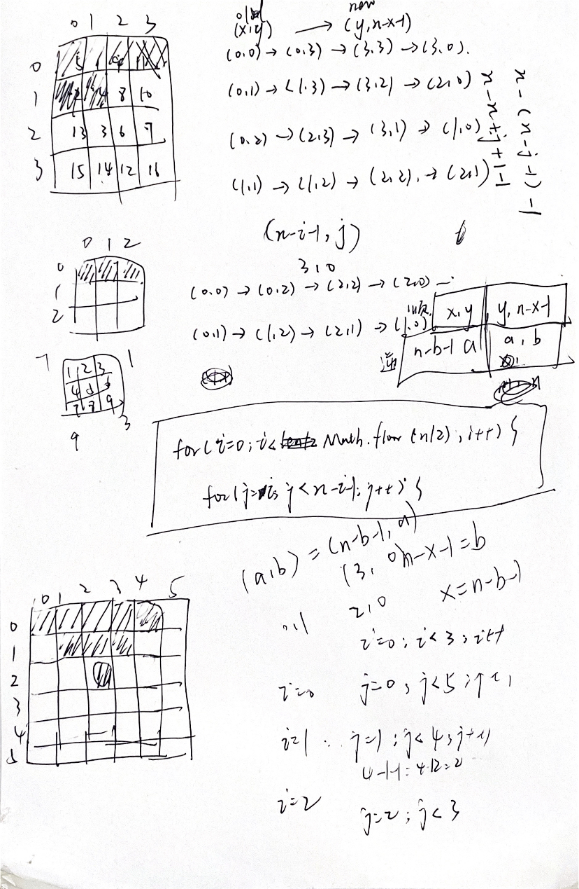

---
group:
  title: 热题100
  path: /algorithm/hot100
---

# [48. 旋转图像](https://leetcode.cn/problems/rotate-image/)

## 思路

列举`n = 3, 4, 5`可以发现，其实需要旋转的位置有画虚线的几个格：  其中`i`遍历的范围为`[0, Math.floor(n/2))`，`j`遍历的范围为`[i, n - i - 1)`

然后对于位置为`(x, y)`的元素，顺时针旋转后位置变成了倒数第`x`列的第`y`个元素，即`(y, n - x - 1)`; 那么可以反推出位置为`(a, b)`的元素，逆时针旋转后位置变成了`(n - b - 1, a)`;

那遍历每一个需要旋转的单元格，先把它逆时针位置上的元素值记录下来为 temp，然后逆时针依次将每个位置的值改为该逆时针位置的值，最后把当前位置的值改为 temp，反正就是逆时针覆盖值一圈。

## 代码

```typescript
/**
 Do not return anything, modify matrix in-place instead.
 */
function rotate(matrix: number[][]): void {
  // console.log('rotate: ', matrix);
  const n = matrix[0].length;
  let temp: number;
  for (let i = 0; i < Math.floor(n / 2); i++) {
    for (let j = i; j < n - i - 1; j++) {
      // temp = m[3][0]
      temp = matrix[n - j - 1][i];
      // 将matrix[i][j]顺时针旋转
      // m[3][0] = m[3][3]
      matrix[n - j - 1][i] = matrix[n - i - 1][n - j - 1];
      // m[3][3] = m[0][3]
      matrix[n - i - 1][n - j - 1] = matrix[j][n - i - 1];
      // m[0][3] = m[0][0]
      matrix[j][n - i - 1] = matrix[i][j];
      // m[0][0] = temp
      matrix[i][j] = temp;
    }
  }
  // console.log('matrix: ', matrix);
}

rotate([
  [1, 2, 3],
  [4, 5, 6],
  [7, 8, 9],
]);
```
