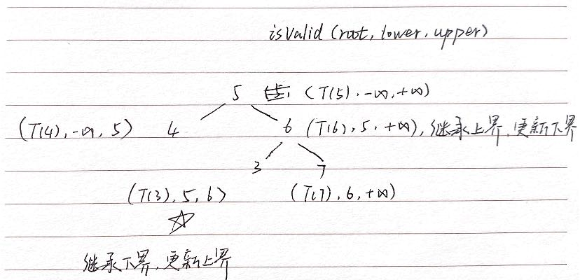

---
group:
  title: 热题100
  path: /algorithm/hot100
---

# [98. 验证二叉搜索树](https://leetcode.cn/problems/validate-binary-search-tree/)

## 思路

重要的是别想太多，一次考虑一个节点就行，老是倾向于考虑这个节点和它的左右子节点；

对于一个二叉搜索树中的节点来说，如果它有父节点：

- 它是左子节点，那么它的值有上界限制，要小于父节点的值，并且满足父节点的上下界要求（即继承下界，更新上界）；
- 它是右子节点，那么它的值有下界限制，要大于父节点的值，并且满足父节点的上下界要求（即继承上界，更新下界）；

对于根节点来说，上下界为正负无穷；

所以递归函数 isValid 只和当前节点 node，上下界 lower, upper 有关：（通过继承就能精准把控每一个节点的范围）

- 如果 node.val 不在(lower, upper)内，返回 false;
- 否则递归判断左右子节点:
  - 判断左时更新上界 isValid(node.left, lower, node.val);
  - 判断右时更新下界 isValid(node.right, node.val, upper)；

## 代码

<code src="./index.tsx"></code>
