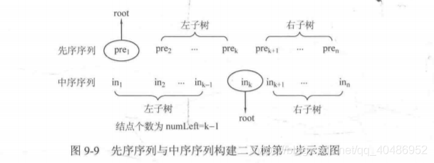
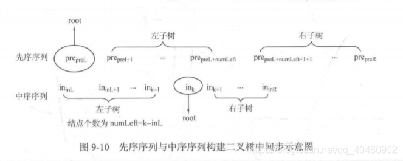

---
group:
  title: 热题100
  path: /algorithm/hot100
---

# [105. 从前序与中序遍历序列构造二叉树](https://leetcode.cn/problems/construct-binary-tree-from-preorder-and-inorder-traversal/?favorite=2cktkvj)

## 思路

[大学时期的博客](https://blog.csdn.net/qq_40486952/article/details/105241944) 那会儿这种题做的得心应手啊。。。

得到中序和先序的数组，先序数组的下标范围记为 preL、preR,中序数组的下标范围记为 inL、inR。

在中序中找到先序的第一个元素（这是根），记录其下标 k 根据下标就可以计算出左子树和右子树的元素个数（也可以说是元素范围），例如左子树元素个数 numLeft 为 k-inL。递归建立根的左子树和右子树。例如左子树的先序数组范围变为了 preL+1、preL+numLeft，中序数组下标范围变为了 inL, k-1。注意递归边界：preL>preR。

贴一下算法笔记中的图解，非常好理解。





伪代码：

```cpp
node* buildTree(int preL, int preR, int inL, int inR){
	if(preL > preR) return NULL;
	node* root = new node; //记得要新建空间啊！这里老忘记，不new一个node就出错了
	root->data = pre[preL];
	int k = 0;//根节点在中序中的位置
	for(int i=inL; i<=inR; i++){
		if(in[i] == root->data){
			k = i;
			break;
		}
	}
	int numLeft = k-inL;
	root->left = buildTree(preL+1, preL+numLeft, inL, k-1);
	root->right = buildTree(preL+numLeft+1, preR, k+1, inR);
	return root;
}
```

## 代码

<code src="./index.tsx"></code>
