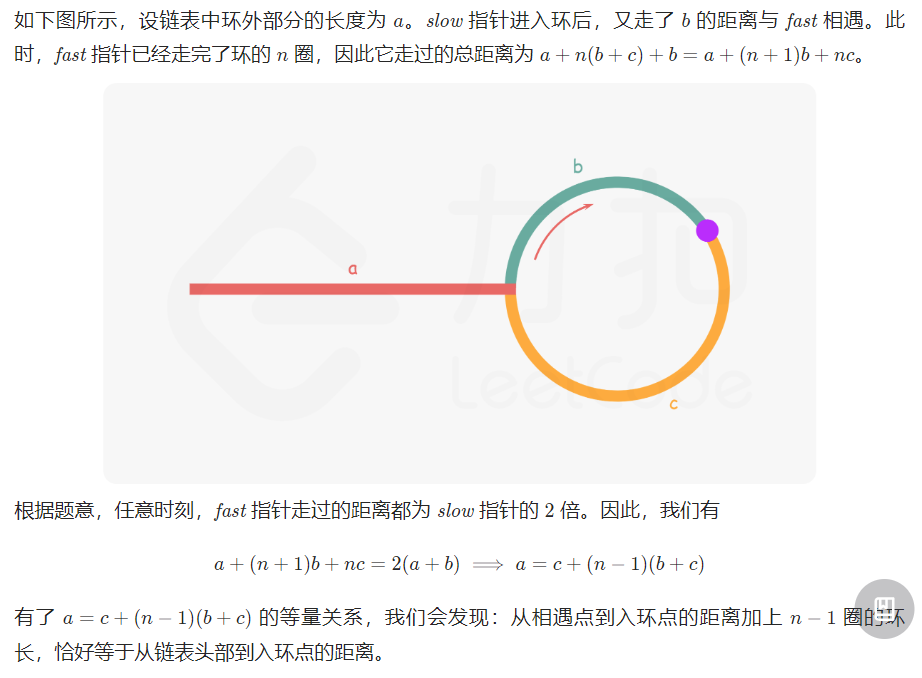

---
group:
  title: 热题100
  path: /algorithm/hot100
---

# [142. 环形链表 II](https://leetcode.cn/problems/linked-list-cycle-ii/?favorite=2cktkvj)

## 思路

做过，但是忘记了...

紫色点为相遇点，慢指针走的路程`a+b`是快指针走的路程`a+n(b+c)+b = a+(n+1)b+nc`的一半；所以可以得到链表头到入环第一个节点的距离`a = c+(n-1)(b+c)`；

那么对慢指针来说，再走若干圈+c 的距离就等于 a；

不好理解的来了：于是让一个指针 ptr 从链表头开始，让慢指针从相遇点开始，同时往后一起走，它们终会在入环点相遇（其中 ptr 走的距离就是 a，慢指针 slow 走的距离是若干圈+c，由上面推导得到若干圈+c 也是 a）。

## 代码

<code src='./index.tsx'></code>
