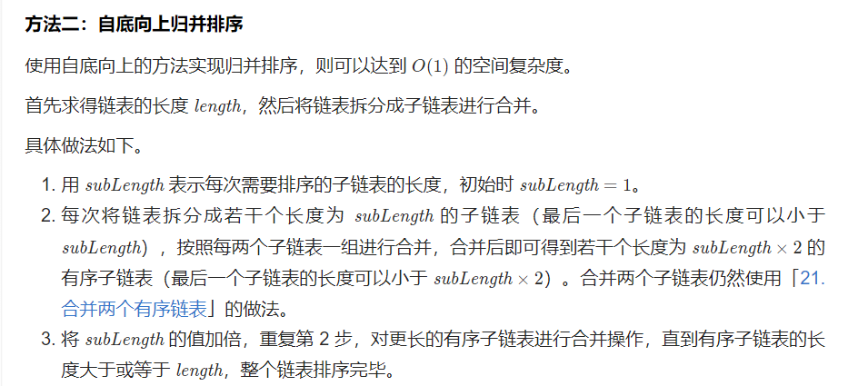

---
group:
  title: 热题100
  path: /algorithm/hot100
---

# [148. 排序链表](https://leetcode.cn/problems/sort-list/?favorite=2cktkvj)

## 思路

两个链表的合并还能写，感觉归并中好多细节，要手写熟悉熟悉，不能光看！。 // TODO 写一遍

## 代码

<code src='./index.tsx'></code>
