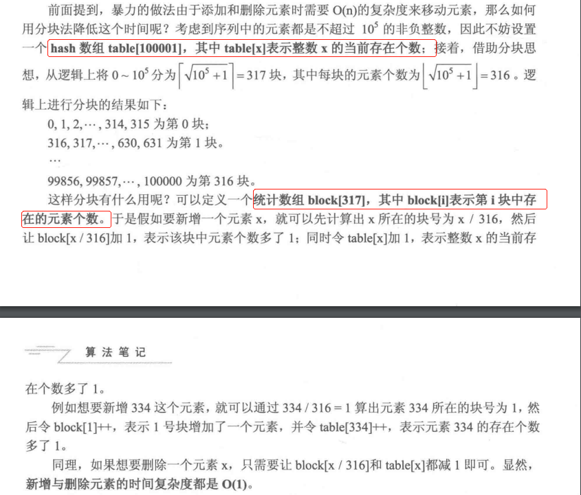
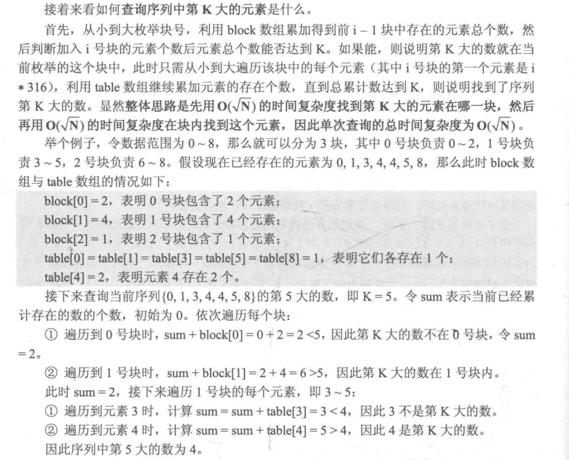
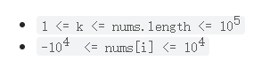

---
group:
  title: 热题100
  path: /algorithm/hot100
---

# [215. 数组中的第 K 个最大元素](https://leetcode.cn/problems/kth-largest-element-in-an-array/?favorite=2cktkvj)

## 思路

分块思想，见胡凡-算法笔记 P476 页；支持动态插入和删除的有序数组，实现在线查询。

本题的不同：

1. 数组开始无序，那么就当调用了`n`次插入（n \* O(1) = O(n)），然后查询第`k`大(O(根号 n))；
2. 找的是第`k`个最大的数，也就是`n - k + 1`大的数；
3. 元素可能为负数，其范围是[-10000, 10000]，那么添加每个元素的时候都加 10000 再操作，找到答案后减 10000： 

那么元素最大为`maxn = 20000`, 分成`sqrn = Math.sqrt(maxn)`块，用`table[i]`（长度为 maxn）表示`i`出现的次数，用`block[i]`（长度为 sqrn）表示第`i`块中的元素个数；

## 代码

<code src='./index.tsx'></code>
