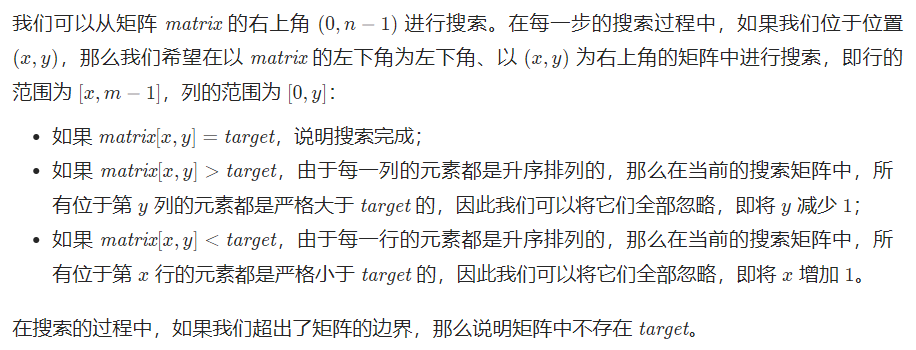

---
group:
  title: 热题100
  path: /algorithm/hot100
---

# [240. 搜索二维矩阵 II](https://leetcode.cn/problems/search-a-2d-matrix-ii/?favorite=2cktkvj)

## 思路

我的思路（错误）：

- 先在第一行找到元素 matrix[0][j]，满足 matrix[0][j-1] < target && matrix[0][j+1] > target; 那么 target 一定在第 j 列；
- 在第一列找到元素 matrix[i][0]，满足 matrix[i-1][0] < target && matrix[i+1][0] > target; 那么 target 一定在第 i 行；

然后遍历第 i 行和第 j 列，能找到就是 true，否则 false；时间复杂度 O(n);

上面那种是不对的，例如在第一行找到最后一个小于 target 的数，也不能保证 target 一定在该元素下方。

官方题解：z 字形搜索

收获：我本来也想到了从(0, 0)开始搜索，然后根据条件决定是继续往右还是往下搜索，发现不行；下次记得换一换起点考虑。

## 代码

<code src='./index.tsx'></code>
