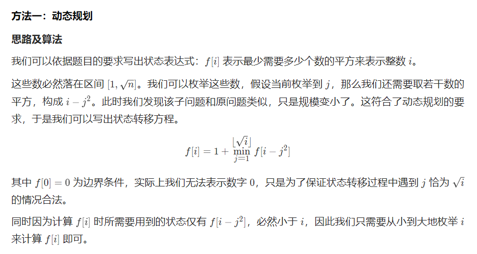

---
group:
  title: 热题100
  path: /algorithm/hot100
---

# [279. 完全平方数](https://leetcode.cn/problems/perfect-squares/?favorite=2cktkvj)

## 思路

我的思路是用 dfs，参数是当前要拼的和 sum 和目前已经用的完全平方数个数 num，然后找到 sum 的上界 upperIdx，遍历 0 到 upperIdx，继续深搜;

超时了 555，仔细思考也确实可以发现 dfs 的状态多次相同了。可以考虑改成动态规划。

【顺便回忆了下二分，lower_bound 找第一个大于等于 x 的元素；upper_bound 找第一个大于 x 的元素；】

官方思路： 

## 代码

<code src='./index.tsx'></code>
