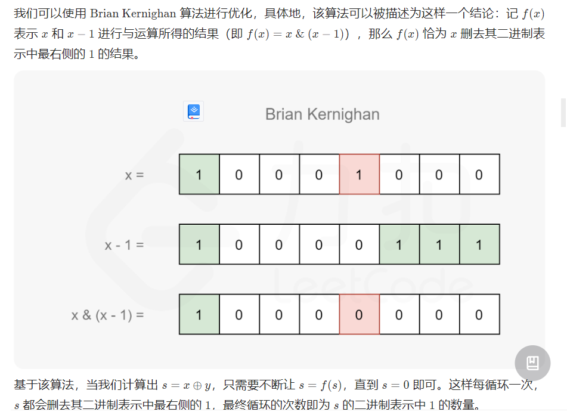

---
group:
  title: 热题100
  path: /algorithm/hot100
---

# [461. 汉明距离](https://leetcode.cn/problems/hamming-distance/?favorite=2cktkvj)

## 思路

### 我的常规思路

取出`x`和`y`的第`bit`位，总是令`base = 2^bit`;

- `x & (1 << bit) = x & base`;
- `y & (1 << bit) = y & base`;

`res = 0`记录不相同的位数个数；

看这两位是否不相同用异或：二者异或之后右移: `res += ((x & base) ^ (y & base)) >> bit;`

- 为`1`说明不相同
- 为`0`说明相同；刚好可以直接加到 res 上。

### 官方有更好的解法 - Brian Kernighan 算法

- 先计算 s = x ^ y；先异或，答案就是 s 中的 1 的个数；
- 基于 Brian Kernighan 算法，s & (s - 1) 就是删去 s 最右侧那个 1 的值；
  - 循环令 s = s & (s-1), res++; 直到 s = 0（没有 1 可以删除了） 

## 代码

<code src='./index.tsx'></code>
