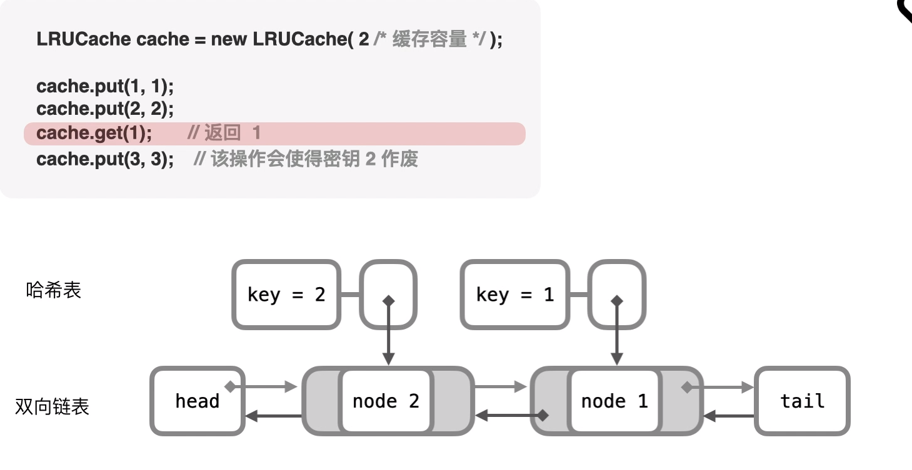

---
group:
  title: 热题100
  path: /algorithm/hot100
---

# [146. LRU 缓存](https://leetcode.cn/problems/lru-cache/?favorite=2cktkvj)

## 思路

构造双向链表试试；

官方题解给的方法是哈希表 + 双向链表; 

最近访问和插入的节点总是插入 tail 前，这样 head 后面就是最近最久未使用的节点；

## 代码

<code src='./index.tsx'></code>
